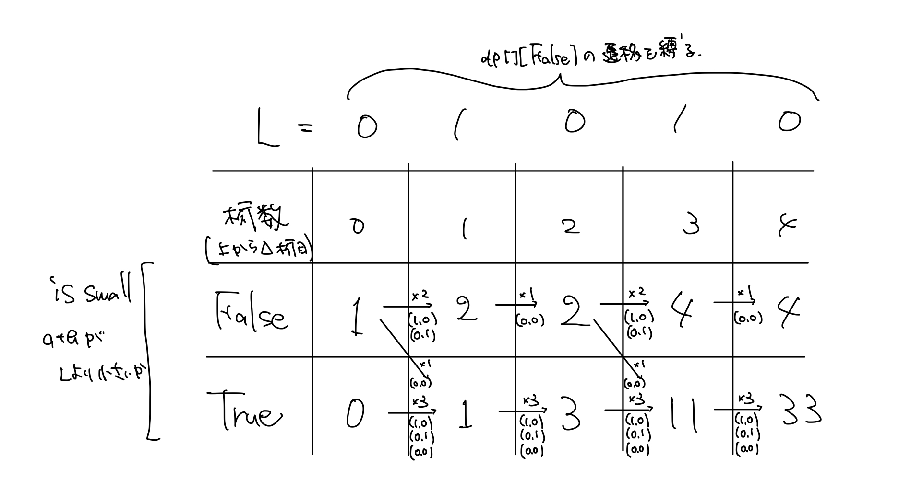

# ABC129 E - Sum Equals Xor

[https://atcoder.jp/contests/abc129/tasks/abc129_e](https://atcoder.jp/contests/abc129/tasks/abc129_e)  
水色上位。XOR。

$a + b = 2 * (a\space\&\space b) + a \oplus b$ より条件の $a+b=a\oplus b$ は $a\space\&\space b=0$ に言い換えられる。

$a\space\&\space b=0$ を満たす $a,b$ の組み合わせは $(0,1),(1,0),(0,0)$ に限られるので、桁上がりが発生しないことを考えると、桁の大きい方から $a_{...i}+b_{...i}$ が $L$ を超えないように $a,b$ の個数を数えていけばよい。
（ $x_{...i}$ は $x$ の 2 進数表記の上から $i$ 桁まで。）

```py
MOD = 10**9 + 7

L = input()
dp = [[0, 0] for _ in range(len(L) + 1)]
# dp[digit][is_small] := 上からdigit桁まで見てきたときに、既にa+bがLより小さいことが確定している(is_small)a, bの組み合わせの個数

dp[0][False] = 1

for digit in range(len(L)):

    # 既に小さいことが確定しているので何をとってもいい
    dp[digit + 1][True] += dp[digit][True] * 3  # (1, 0), (0, 1), (0, 0)

    if int(L[digit]) == 1:
        dp[digit + 1][True] += dp[digit][False] * 1  # (0, 0)
        dp[digit + 1][False] += dp[digit][False] * 2  # (1, 0), (0, 1)

    if int(L[digit]) == 0:
        dp[digit + 1][False] += dp[digit][False] * 1  # (0, 0)

    dp[digit + 1][True] %= MOD
    dp[digit + 1][False] %= MOD


if __name__ == "__main__":
    print(sum(dp[len(L)]) % MOD)
```
