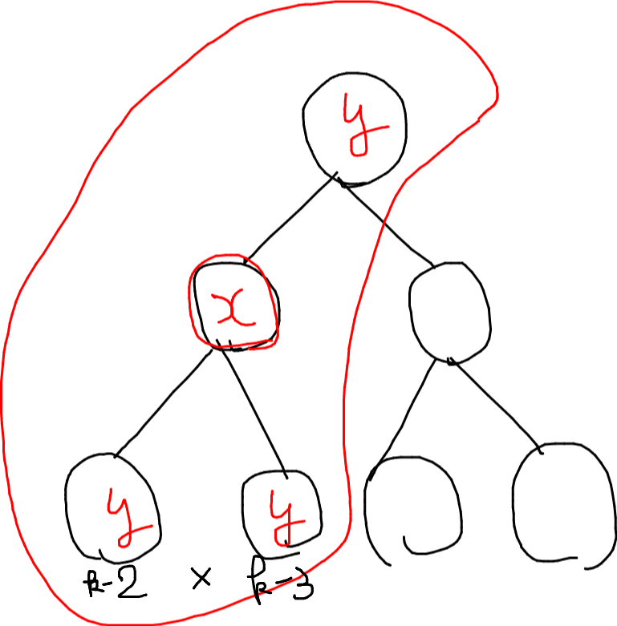

# ABC133 E - Virus Tree 2

[https://atcoder.jp/contests/abc133/tasks/abc133_e](https://atcoder.jp/contests/abc133/tasks/abc133_e)  
水色上位。木。

頂点 $x,y$ の距離が 2 以下とはどういうことかというと、
ある頂点とそれに隣接している頂点すべて
である。


根を頂点 1 とすると、根以外の頂点を塗る時は既に親が塗られているため $k$ から 1 を除き、さらに自分自身を塗った $k-2$ 通りの中から自分の子供の色を決めることになる。
根の場合は根の子供を $k-1$ 通りの中から色を決める。

```py
MOD = 10**9 + 7

n, k = map(int, input().split())
tree = [[] for _ in range(n + 1)]
for _ in range(n - 1):
    a, b = map(int, input().split())
    tree[a].append(b)
    tree[b].append(a)

ans = k


def dfs(u, p=-1):
    global ans
    rest = k
    if p != -1:
        rest -= 1
    for v in tree[u]:
        if v == p:
            continue
        rest -= 1
        ans *= rest
        ans %= MOD
        dfs(v, u)


dfs(1)
print(ans)

```
