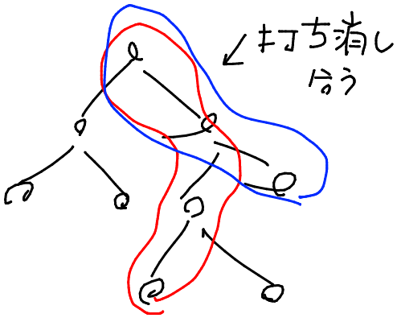

# ABC201 E - Xor Distances

[https://atcoder.jp/contests/abc201/tasks/abc201_e](https://atcoder.jp/contests/abc201/tasks/abc201_e)  
青色下位。XOR。

**重要な知見**
木上でパスの XOR は根からの XOR と等しい
同じものを xor すると単位元になるので、根からの各頂点へのパスの XOR を保持しておくと、ある 2 頂点のパスの XOR を求める時に重複する部分が消える



よってある頂点を根とした木の上で DFS を行い、頂点からの累積 xor を計算した上で各 bit ごとに xor 和を計算したらよい。
xor 和は、1 の個数とそうでないものの個数の積で求まる。

```py
MOD = 10**9 + 7

n = int(input())
tree = [[] for _ in range(n)]

for _ in range(n - 1):
    u, v, w = map(int, input().split())
    tree[u - 1].append((v - 1, w))
    tree[v - 1].append((u - 1, w))

# xor[u] := 根からuまでのパスのxor
xor = [0] * n

stack = [(0, -1)]
while stack:
    u, p = stack.pop()
    for v, w in tree[u]:
        if v == p:
            continue
        xor[v] = xor[u] ^ w
        stack.append((v, u))

ans = 0

for shift in range(60):
    count_0 = count_1 = 0
    for u in range(n):
        if xor[u] >> shift & 1:
            count_1 += 1
        else:
            count_0 += 1
    ans += count_0 * count_1 * pow(2, shift, MOD) % MOD
    ans %= MOD

print(ans)

```
