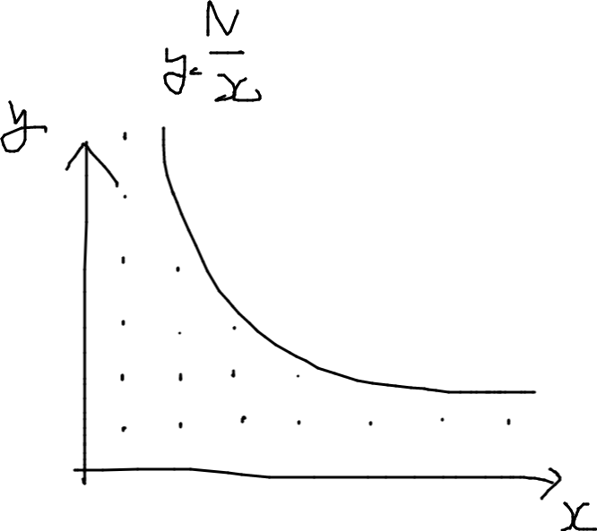
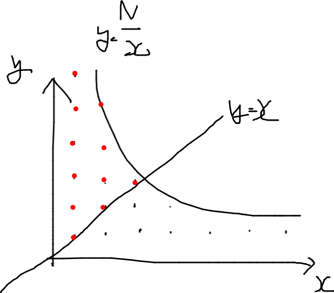
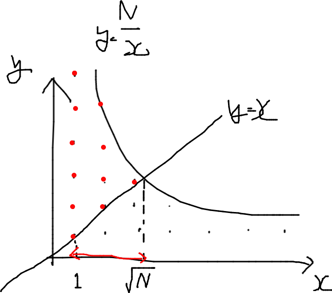
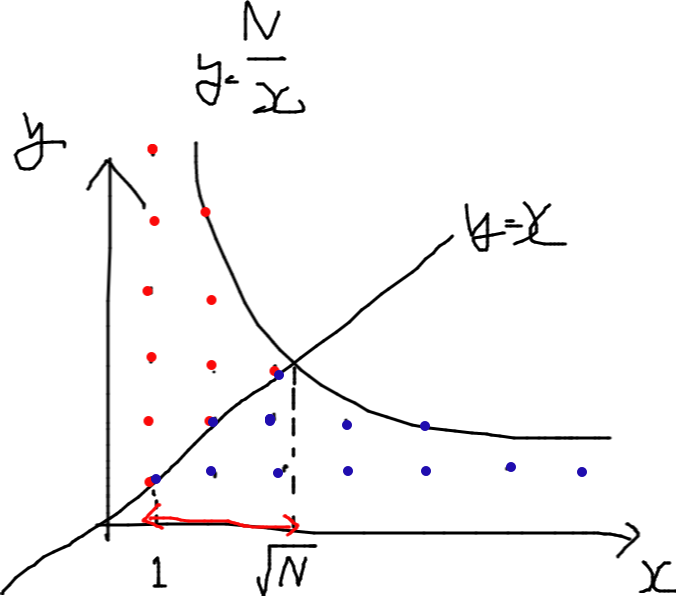

# ABC230 E - Fraction Floor Sum

[https://atcoder.jp/contests/abc230/tasks/abc230_e](https://atcoder.jp/contests/abc230/tasks/abc230_e)  
緑下位。整数問題


実は $y\le \frac{N}{x} \space(x>0,y>0)$ の格子点の数を問われている。


上図は $y=x$ で対称なので、 $y\ge x$ となる部分の格子点の個数を求めて 2 倍してやればよい。

このとき $y=x$ と $y=\frac{N}{x}$ の交点の座標は $x=\sqrt{n}$ であり、 $x(1\le x \le\sqrt{n})$ の範囲の格子点を数え上げればよいことになる。

$y\le\frac{N}{x}$ と $y\ge x$ に囲まれた部分の格子点の個数は、 $\left\lbrack{\frac{N}{x}}\right\rbrack - (x - 1)$ で求まるので、 $1\le x \le\sqrt{n}$ について計算し足し合わせる。

```py
grid = 0
for x in range(1, int(N ** .5) + 1):
    grid += N // x - (x - 1)

```



前述の通り $y=x$ で線対称なので値を 2 倍し、重複して数えられた $y=x$ 上の格子点を除けば答えとなる。

```py
N = int(input())

grid = 0
for x in range(1, int(N ** .5) + 1):
    grid += N // x - (x - 1)

print(grid * 2 - int(N ** .5))

```
