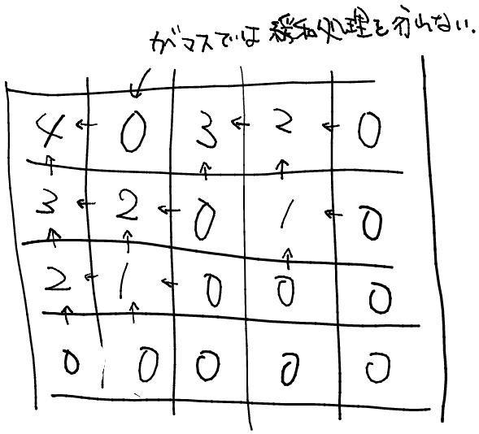

# ABC232 D - Weak Takahashi

[https://atcoder.jp/contests/abc232/tasks/abc232_d](https://atcoder.jp/contests/abc232/tasks/abc232_d)

茶色下位。
BFS かなと思いきや、DP で解くらしい。

考え方は次の通り。

> あるマス $(i,j)$ を踏むとき、その上のマス $(i−1,j)$ か、 左のマス $(i,j−1)$ から来る以外の方法はありません。左のマスと上のマスまでの最大距離が確定していれば、あとから $C_{i,j}$ の最大距離が更新されることはないので、動的計画法を使えます。

**ある状態から次の状態までへの遷移方法が有限である場合に DP が有効**ということだろうか。

上の考え方を逆転させて、下のマスと右のマスの、そこから立ち止まるまでに通ることのできるマスの個数の最大値)が確定しているならばその上(左)のマスも確定する事が出来る。


`dp[i][j] :=`マス $(i, j)$ から歩き始めた時、立ち止まるまでに通ることのできるマスの個数の最大値

貰う DP 方式で、現在探索しているマス目が空白マスの時、既に確定している右と下の値のうち、大きい方を+1 した値そのマスの値として更新する。グリッドの外や壁マスは 0 として扱えば上手くいく。

サンプル 1 のグリッドでの緩和処理後のマス目は次の通り。

緩和処理は下から順に、右から左へ行われるので、「自身の右と下のマスの値が確定していないのに、自身のマスが処理されようとする」といったことは起こらない。

```py
h,w = map(int,input().split())
c = [list(input()) for _ in range(h)]

dp = [[0 for _ in range(w+1)] for _ in range(h+1)]

for row in range(h)[::-1]:
    for col in range(w)[::-1]:
        if c[row][col] == '#':
            continue
        dp[row][col] = max(dp[row+1][col], dp[row][col+1]) + 1
print(dp[0][0])

```
