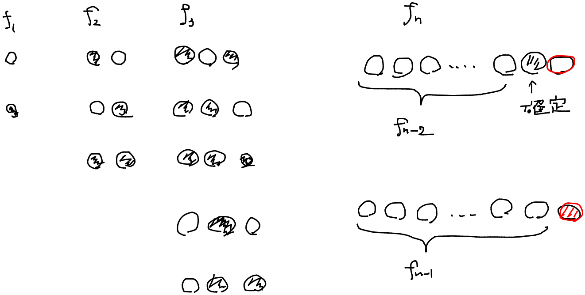
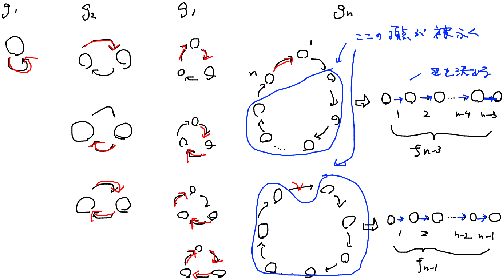

# ABC247 F - Cards

[https://atcoder.jp/contests/abc247/tasks/abc247_f](https://atcoder.jp/contests/abc247/tasks/abc247_f)  
青色下位。数え上げ。

**知見**
あるサイクルの辺被覆となる辺の選び方の総数について

いきなり円環は考えにくいため、直線上での辺被覆っぽいものを考える。

$f_i := 1,2,...,iの隣接する2点のうち、少なくとも片方を選ぶ場合の数$
$f_1=2$
$f_2=1$
$f_3=3$
$f_i=f_{i-1}+f_{i-2}$


$g_i := サイズiのサイクルの辺被覆となる辺の選び方の総数$
$g_1=1$
$g_2=3$
$g_3=4$
$g_i=f_{i-1}+f_{i-3}$



```py
from atcoder.dsu import DSU

MOD = 998244353


def memorize(f):
    memo = {}

    def inner(arg):
        if arg not in memo:
            memo[arg] = f(arg)
        return memo[arg]

    return inner


def matmul(mat1, mat2):
    res = [[0] * len(mat2[0]) for _ in range(len(mat1))]
    for i in range(len(mat1)):
        for j in range(len(mat2[0])):
            for k in range(len(mat2)):
                res[i][j] += mat1[i][k] * mat2[k][j]
                res[i][j] %= MOD
    return res


def matpow(mat, p):
    res = [[0] * len(mat) for _ in range(len(mat))]
    for i in range(len(mat)):
        res[i][i] = 1
    while p > 0:
        if p & 1:
            res = matmul(res, mat)
        mat = matmul(mat, mat)
        p >>= 1
    return res


@memorize
def lucas(n):
    a = matpow([[1, 1], [1, 0]], n)
    res = matmul(a, [[1], [2]])
    return res[1][0]


n = int(input())
p = list(map(int, input().split()))
q = list(map(int, input().split()))

dsu = DSU(n)
for l, r in zip(p, q):
    dsu.merge(l - 1, r - 1)

ans = 1
for group in dsu.groups():
    ans *= lucas(len(group))
    ans %= MOD

print(ans)

```
