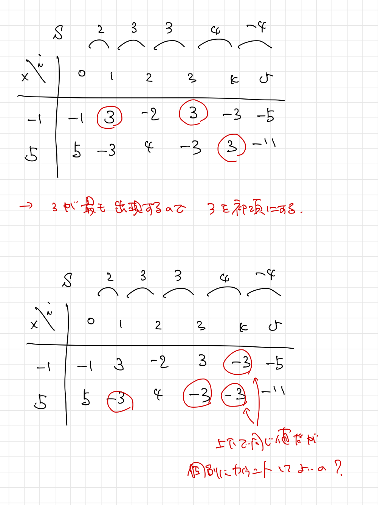

# ABC255 E - Lucky Numbers

[https://atcoder.jp/contests/abc255/tasks/abc255_e](https://atcoder.jp/contests/abc255/tasks/abc255_e)  
水色上位。Ad-Hoc。

**典型考察**
階差数列が与えられたとき、元の数列のある要素を確定させると他の要素も一意に定まる

今回は上の典型考察を**逆手に**とって、条件を満たすような初項を予め列挙する。つまり、各 $i=1,2,\ldots,n,j=1,2,\ldots,m$ について、 $A_i=X_j$ となるような数列の初項 $A_1$ を計算し、最も出現回数が多かったものを採用すればよい。

具体的な計算式は公式解説を参照のこと。

---

計算された各初項で最も出現回数が多いものとのことであるが、例えば上下で同じ値になった場合も出現回数としてカウントしてよいのだろうかという疑問を持った。

そもそもこのようなことは、定義から $X_{j}=X_{j}$ のときにしか起こり得無いため、制約の $X_1<X_2<\dots<X_m$ から気にせずカウントしてよい。
