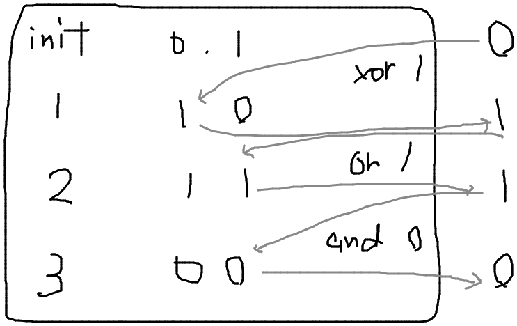

# ABC261 E - Many Operations

[https://atcoder.jp/contests/abc261/submissions/38341930](https://atcoder.jp/contests/abc261/submissions/38341930)

**POINT**
`and`, `or`, `xor`演算はビットで独立

以後特定のビットについて考える。

関数の取り得る値は $0,1$ の 2 通りなので、初期値が $0,1$ のとき $1,2,...n$ 回の連続した操作の後に、それぞれどう変化するのかを記録しておけばよい。

入力例１の末尾ビットに対する操作の例
`C = 0`, 操作は順に`xor 1`, `or 1`, `and 0`



pypy ではかなりギリギリ。TLE になってももう一度提出すれば通るかも。

```py
import operator


n, c = map(int, input().split())
ta = [list(map(int, input().split())) for _ in range(n)]

ops = operator.and_, operator.or_, operator.xor


a_bits = [list(map(int, bin(c)[2:].zfill(30)))] + [[0] * 30 for _ in range(n)]

for bit in range(30):
    temp_bit = [0, 1]
    for i in range(n):
        op = ops[ta[i][0] - 1]
        a = ta[i][1] >> (29 - bit) & 1
        temp_bit = list(map(lambda x: op(x, a), temp_bit))

        a_bits[i + 1][bit] = temp_bit[a_bits[i][bit]]

for i in range(1, n + 1):
    print(int("".join(map(str, a_bits[i])), 2))

```
