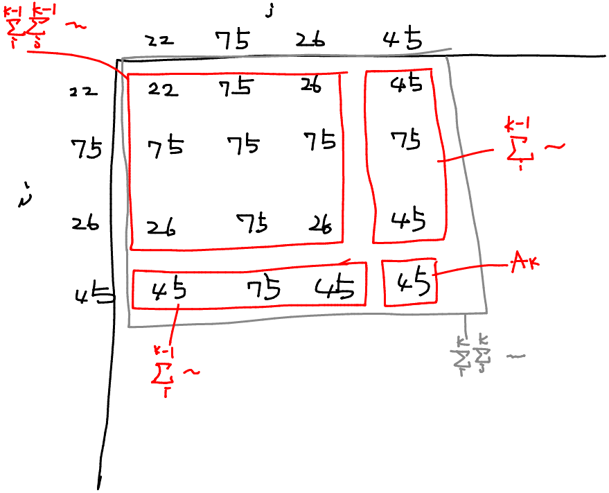

# ABC276 F - Double Chance

[https://atcoder.jp/contests/abc276/tasks/abc276_f](https://atcoder.jp/contests/abc276/tasks/abc276_f)  
水色上位。期待値。

$i=1,2,\ldots,K$ $j=1,2,\ldots,K$ に対して $\max(A_i,A_j)$ が計算される（つまりカード $i$ とカード $j$ が取り出される）確率はすべて等しく $K^2$ である。

期待値の線形性から $\sum_{i}^{K}\sum_{j}^{K}{\max(A_i,A_j)}$ を高速に計算できればよい。

また上式は $\sum_{i}^{0}\sum_{j}^{0}{\max(A_i,A_j)}=0$ と考えると、 $\sum_{i}^{K}\sum_{j}^{K}{\max(A_i,A_j)}=\sum_{i}^{K-1}\sum_{j}^{K-1}{\max(A_i,A_j)}+\sum_{i}^{K}{\max(A_i,A_K)}\times2+A_K$ と変形できるから、 $K=1,2,\ldots,N$ と小さい $K$ から順に計算していくことができる。


第 2 項は BIT により計算できる。 $A_k$ に対して、 $A_k$ 以下の要素に対してはその個数 × $A_k$ 、 $A_k$ より大きい要素に対しては、もう 1 本 BIT を用意しておきそちらで計算する。詳しくは実装を。

```py
from atcoder.fenwicktree import FenwickTree

MOD = 998244353

n = int(input())
a = list(map(int, input().split()))

max_a = max(a)

# bit0[i] := a[:k]に含まれるiの個数
bit0 = FenwickTree(max_a + 1)
# bit1[i] := a[:k]に含まれるiの個数×i
bit1 = FenwickTree(max_a + 1)

numerator = 0

for k in range(n):
    subtotal = 0u
    subtotal += bit0.sum(0, a[k] + 1) * a[k]
    subtotal += bit1.sum(a[k] + 1, max_a + 1)
    denominator_inv = pow((k + 1) * (k + 1), MOD - 2, MOD)
    numerator = numerator + subtotal * 2 + a[k]
    print(numerator * denominator_inv % MOD)
    bit0.add(a[k], 1)
    bit1.add(a[k], a[k])

```
