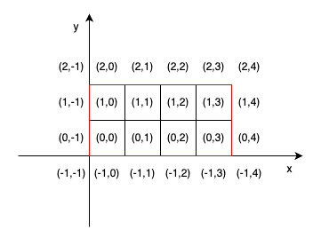
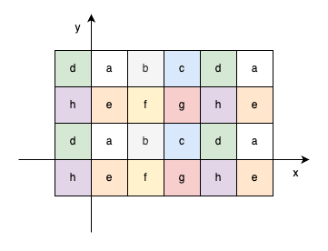
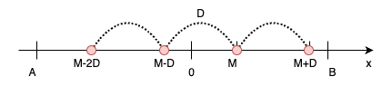

# ABC354 D - AtCoder Wallpaper

https://atcoder.jp/contests/abc354/tasks/abc354_d  
水色下位。

ある周期的な模様の面積を求める問題。

簡単な観察から、下図の赤枠で示した $4\times{2}$ の面積が周期的に配置されていることは容易に分かる。



$4\times{2}$ の長方形のまま面積を求めようとすると難しいが、何も長方形のまま考える必要はなく、長方形に含まれる $1\times{1}$ の $8$ 個の正方形をそれぞれ独立に考えることで見通しがよくなる。
そこで次の問題を考える。

> 整数 $A,B,C,D$ が与えられる。$i\in\{0,1,2,3\},j\in\{0,1\}$ に対して、それぞれ $A\le{x}\le{C},B\le{y}\le{D}, x\text{ mod }4=i, y\text{ mod }2=j$ を満たす $(x,y)$ の個数を求めよ。

要するに、下図のようにある範囲が与えられるので、白マスは何個あるか？灰マスは何個あるか？青マスは何個あるか？・・・のように、各色ごとにマスの個数を数え上げればいいのである。



各色のマスが範囲に何個含まれるかが分かれば、それぞれの色に対応するマスの面積を乗じ足し合わせることで解が得られる。

各色のマスの個数を計算するために、さらに次の小問題を考える。

> $A,B(-10^9\le{A}\le{B}\le{10^9})$ と $D(0\lt{D}\le{10^9})$、$M(0\le{M}\lt{D})$ が与えられる。以下の条件を満たす $x$ の個数を求めよ。
> $$A\le{x}\le{B} \text{ and } x\text{ mod }{D}=M $$



これは次のようにして定数時間で求めることが可能である。

$$
(B-M)/D-(A-1-M)/D
$$

この小問題を $x,y$ 軸にてそれぞれに適用することで、各色のマスの個数を計算することができた。

## 提出コード

```py showLineNumbers
# -*- coding: utf-8 -*-

"""
------------ (c,d)
|             |
|             |
|             |
(a,b)----------
"""


def count(a: int, b: int, d: int, m: int) -> int:
    """
    Count the number of integers x that satisfy the following condition:
    x | a <= x <= b && x % d == m

    Constraint
    - -10^9 <= a <= b <= 10^9
    - 1 <= d <= 10^9
    - 0 <= m < d

    >>> count(4, 8, 2, 0)   # 4, 6, 8
    3
    >>> count(-6, 5, 2, 0)  # -6, -4, -2, 0, 2, 4
    6
    >>> count(-5, 4, 2, 1)  # -5, -3, -1, 1, 3
    5
    """

    return (b - m) // d - (a - 1 - m) // d

# unit[x][y] := x % 4 == i && y % 2 == j となる (x, y) の面積
unit = [[2, 1], [1, 2], [0, 1], [1, 0]]

a, b, c, d = map(int, input().split())

ans = 0
for x in range(4):
    for y in range(2):
        ans += unit[x][y] * count(a, c - 1, 4, x) * count(b, d - 1, 2, y)

print(ans)

```

[Python (PyPy 3.10-v7.3.12), 62 ms](https://atcoder.jp/contests/abc354/submissions/53655907)
