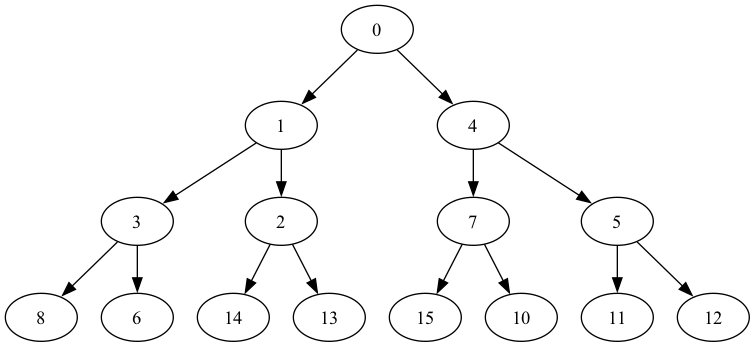
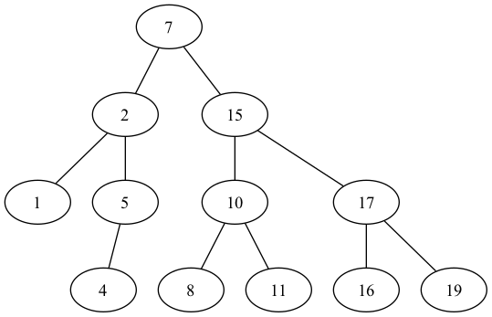

import { Callout } from "nextra/components";

# 2-4 データを工夫して記憶する "データ構造"

## 木・二分木

...

## プライオリティキューとヒープ

### プライオリティキュー

- 数の追加
- 最小の数値を取り出す

プライオリティキューは抽象データ構造であり、ヒープはこれを二分木を用いて効率的に実装する。

### ヒープ

- 子の数字は親の数字よりも大きい
- 葉ノードは左から順に埋められる（完全ニ分木）
- 高々、最大の深さまでしか繰り返しは起こらない。計算量は $\mathcal{O}(\log{N})$

実際には一次元配列とビット演算を用いて実装を行うことが可能である。

```python copy=false
>>> import heapq, random
>>> random.seed(42)
>>>
>>> que = list(range(2 ** 4))
>>> random.shuffle(que)
>>> que
[7, 9, 5, 6, 14, 10, 12, 8, 1, 2, 13, 15, 4, 11, 0, 3]
>>> heapq.heapify(que)
>>> que
[0, 1, 4, 3, 2, 7, 5, 8, 6, 14, 13, 15, 10, 11, 12, 9]
```

```python copy=false
>>> import graphviz
>>> dot = graphviz.Digraph()
>>> for i in range(7):
...     dot.edge(str(que[i]), str(que[2 * i + 1]))
...     dot.edge(str(que[i]), str(que[2 * i + 2]))
...
>>> dot.view()
```



#### プライオリティキューを用いる問題

##### Expedition

```python
# Expedition
```

- その場でガソリンを給油する必要はない
  - 後から時間を巻き戻して給油することが制約より可能
- 各ガソリンスタンドの到着時点をシミュレートし、そのガソリンスタンドへ辿り着けないなら過去に通った未使用のガソリンスタンドで最大限給油したことにする

##### Fence Repair

```python
# Fence Repair
```

- 板の集合から最も短い 2 つの板を取り出し、長さが 2 つの板の長さの和となる板をキューに追加する

## 二分探索木

次の操作を効率的に行うデータ構造

- 数値を追加する
- ある数値が含まれているかを判定する
- ある数値を削除する

任意の頂点 $v$ に対し、$v$ の左部分木に含まれる全ての頂点 $v'$ に対して $key[v]\geqq key[v']$ が成立し、$v$ の右部分木に含まれる全ての頂点 $v'$ に対して $key[v]\leqq key[v']$ が成立する。

【引用】大槻兼資／問題解決力を鍛える アルゴリズムとデータ構造（項 179）

```python copy=false
>>> import graphviz
>>>
>>> dot = graphviz.Graph()
>>> dot.edge("7", "2")
>>> dot.edge("7", "15")
>>> dot.edge("2", "1")
>>> dot.edge("2", "5")
>>> dot.edge("5", "4")
>>> dot.edge("15", "10")
>>> dot.edge("15", "17")
>>> dot.edge("10", "8")
>>> dot.edge("10", "11")
>>> dot.edge("17", "16")
>>> dot.edge("17", "19")
>>> dot.view()
```



## Union-Find 木

次の操作を効率的に行うデータ構造

- 要素 a と要素 b が同じグループに属するか判定する(same)
- 要素 a と要素 b の各々が属するグループを併合する(merge)

```python showLineNumbers
from __future__ import annotations


class DSU:
    """
    無向グラフに対して、
    - 辺の追加
    - 2頂点が連結かの判定

    の操作をならし時間O(α(n))で提供します。
    """

    def __init__(self, n: int) -> None:
        """n頂点0辺の無向グラフを作ります。O(n)"""
        self._parents: list[int] = [-1] * n

    def merge(self, a: int, b: int) -> None:
        """辺(a, b)を足します。O(α(n))"""
        a: int = self.leader(a)
        b: int = self.leader(b)
        if a == b:
            return
        if self._parents[a] > self._parents[b]:
            a, b = b, a
        self._parents[a] += self._parents[b]
        self._parents[b] = a

    def same(self, a: int, b: int) -> bool:
        """頂点a, bが連結かどうかを返します。O(α(n))"""
        return self.leader(a) == self.leader(b)

    def leader(self, a: int) -> int:
        """頂点aの属する連結成分の代表元を返します。O(α(n))"""
        stack: list[int] = []
        while self._parents[a] >= 0:
            stack.append(a)
            a: int = self._parents[a]
        for b in stack:
            self._parents[b] = a
        return a

    def size(self, a: int) -> int:
        """頂点aの属する連結成分のサイズを返します。O(α(n))"""
        return -self._parents[self.leader(a)]

    def leaders(self) -> list[int]:
        """各連結成分の代表元を返します。O(N)"""
        return [i for i, a in enumerate(self._parents) if a < 0]

    def group_count(self):
        """連結成分の個数を返します。O(n)"""
        return len(self.leaders())

```

#### Union-Find 木を用いる問題

##### 食物連鎖

```python
# 食物連鎖
```

- 愚直に割り当ててもいいが、各要素についてそれぞれのグループに属する場合を分けて考えたとしても操作に支障はない
  - 実装が楽になる
  - 対称性が影響
