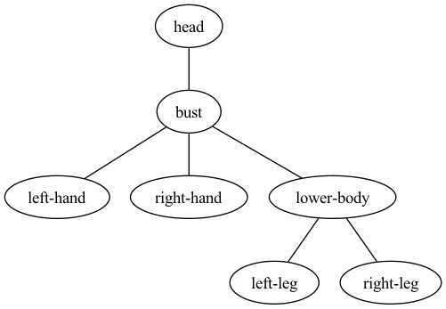
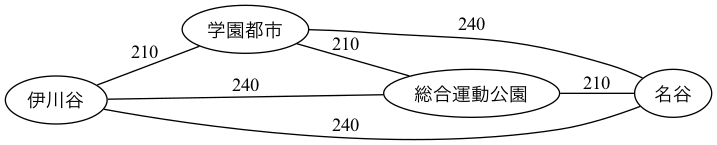
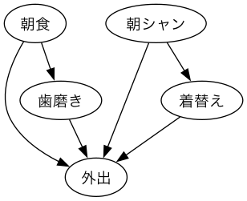
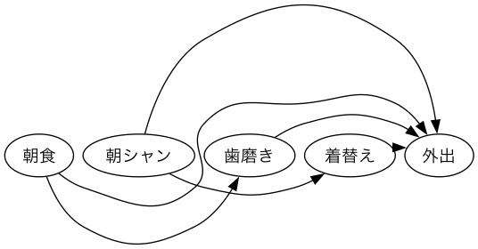
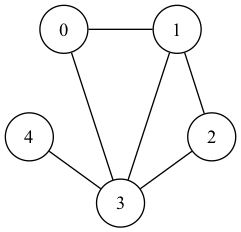
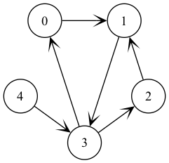

import { Callout } from "nextra/components";
import Graph, { GraphWithHTML } from "@/components/Graph";
import shortestPathDots from "@/assets/atcoder/programming-contest-challenge-book/2-5/01_shortest_path.json";
import bellmanFordDots from "@/assets/atcoder/programming-contest-challenge-book/2-5/02-1_bellman_ford.json";
import bellmanFordNegativeCycleDots from "@/assets/atcoder/programming-contest-challenge-book/2-5/02-2_bellman_ford_negative_cycle.json";
import dijkstraDots from "@/assets/atcoder/programming-contest-challenge-book/2-5/03_dijkstra.json";
import floydWarshallDots from "@/assets/atcoder/programming-contest-challenge-book/2-5/04_1_floyd_warshall_graph.json";
import floydWarshallHTMLs from "@/assets/atcoder/programming-contest-challenge-book/2-5/04_2_floyd_warshall_table.json";
import minimumSpanningTreeDots from "@/assets/atcoder/programming-contest-challenge-book/2-5/05_minimum_spanning_tree.json";
import primDots from "@/assets/atcoder/programming-contest-challenge-book/2-5/06_prim.json";
import kruskalDots from "@/assets/atcoder/programming-contest-challenge-book/2-5/07_kruskal.json";

# 2-5 あれもこれも実は"グラフ"

## グラフとは

- 頂点(vertex, node)と辺(edge)からなる。
- 頂点集合が $V$、辺集合が$E$であるグラフを $G=(V,E)$ と表す
- 2 点 $u,v$ を結ぶ辺を $e=(u,v)$ と表す

### グラフの種類

1. 辺に向きがあるか

- 向きがない → 無向グラフ
- 向きがある → 有向グラフ

```python copy=false
>>> import graphviz
>>>
>>> dot = graphviz.Graph()
>>> dot.edge("head", "bust")
>>> dot.edge("bust", "left-hand")
>>> dot.edge("bust", "right-hand")
>>> dot.edge("bust", "lower-body")
>>> dot.edge("lower-body", "left-leg")
>>> dot.edge("lower-body", "right-leg")
>>> dot.view()
```



```python copy=false
>>> import graphviz
>>>
>>> dot = graphviz.Digraph()
>>> dot.edge("@__dike__", "@INT_MAX_UoH")
>>> dot.edge("@INT_MAX_UoH", "@__dike__")
>>> dot.edge("@__dike__", "@Nishika0507")
>>> dot.edge("@__dike__", "@tomushi_fake")
>>> dot.edge("@tomushi_fake", "@__dike__")
>>> dot.edge("@INT_MAX_UoH", "@tomushi_fake")
>>> dot.edge("@tomushi_fake", "@INT_MAX_UoH")
>>> dot.view()
```

2. 辺に重みがあるか

- 重みがある → 重み付きグラフ
- 重みがない → 重み無しグラフ

```python copy=false
>>> import graphviz
>>>
>>> dot = graphviz.Graph()
>>> dot.attr(rankdir="LR")
>>> dot.edge("伊川谷", "学園都市", label="210")
>>> dot.edge("伊川谷", "総合運動公園", label="240")
>>> dot.edge("伊川谷", "名谷", label="240")
>>> dot.edge("学園都市", "総合運動公園", label="210")
>>> dot.edge("総合運動公園", "名谷", label="210")
>>> dot.edge("学園都市", "名谷", label="240")
>>> dot.view()
```



### 無向グラフの用語

- 隣接している: 2 つの頂点間に辺がある
- パス: 隣接している頂点の列
- 次数: 頂点に繋がっている辺の数
- 木: 閉路を持たない連結グラフ (辺の数 = 頂点数-1)
  - 森: 木の集まり（連結とは限らない、閉路をもたない無向グラフ）

### 有向グラフの用語

有向グラフの頂点 $v$ に対して、$v$ から出ていく辺の集合を $\delta_+(v)$、入ってくる辺の集合を $\delta_-(v)$ と表記する。

- 出自数(indegree): $|\delta_+(v)|$
- 入次数(outdegree): $|\delta_-(v)|$
- DAG(**D**irected **A**cyclic **G**raph): 閉路を持たない有向グラフ  
  ※ acyclic の発音は\[eisáiklik\]

<Callout>
  DAG は 動的計画法と関係深い。詳しくは
  https://youtu.be/U5geMnL9gGU?si=wx_wsov0_oz60jM2&t=250
</Callout>

```python copy=false
>>> import graphviz
>>>
>>> graph = {
...     "外出": ['朝食', "歯磨き", "着替え", "朝シャン"],
...     "歯磨き": ["朝食"],
...     "着替え": ["朝シャン"],
...     "朝シャン": [],
...     "朝食": [],
... }
>>> dot = graphviz.Digraph()
>>> for v in graph:
...     for u in graph[v]:
...         dot.edge(u, v)
...
>>> dot.view()
```



- トポロジカル順序: どのノードもその出力辺の先のノードの前に来るような順序
  - 要するに、一列に並べた時に後ろ向きの辺が存在しない並べ方
- トポロジカルソート: トポロジカル順序を求めること

```python copy=false
>>> import graphlib, graphviz
>>>
>>> graph = {
...     "外出": ['朝食', "歯磨き", "着替え", "朝シャン"],
...     "歯磨き": ["朝食"],
...     "着替え": ["朝シャン"],
...     "朝シャン": [],
...     "朝食": [],
... }
>>> sorter = graphlib.TopologicalSorter()
>>> order = [*sorter.static_order()]
>>> order
['朝食', '朝シャン', '歯磨き', '着替え', '外出']
>>> dot = graphviz.Digraph(graph_attr={"rankdir": "RL", "ranksep": "0"})
>>> for u, v in zip(order, order[1:]):
...     dot.edge(str(v), str(u), style="invis")
...
>>> for v in graph:
...     for u in graph[v]:
...         dot.edge(u, v, constraint="false", style="solid")
...
>>> dot.view()
```



## グラフの表現

### 隣接行列

```python copy=false
>>> import graphviz
>>>
>>> mat = [
...     [0, 1, 0, 1, 0],
...     [1, 0, 1, 1, 0],
...     [0, 1, 0, 1, 0],
...     [1, 1, 1, 0, 1],
...     [0, 0, 0, 1, 0],
... ]
>>> dot = graphviz.Graph(engine="neato")
>>> dot.node_attr["shape"] = "circle"
>>> dot.node("0", pos="-0.59,0.81!")
>>> dot.node("1", pos="0.59,0.81!")
>>> dot.node("2", pos="0.95,-0.31!")
>>> dot.node("3", pos="0.00,-1.00!")
>>> dot.node("4", pos="-0.95,-0.31!")
>>>
>>> for i in range(5):
...     for j in range(i, 5):
...         if mat[i][j]:
...             dot.edge(str(i), str(j))
...
>>> dot.view()
```



```python copy=false
>>> import graphviz
>>>
>>> mat = [
...    [0, 1, 0, 0, 0],
...    [0, 0, 0, 1, 0],
...    [0, 1, 0, 0, 0],
...    [1, 0, 1, 0, 0],
...    [0, 0, 0, 1, 0],
... ]
>>> dot = graphviz.Graph(engine="neato")
>>> dot.node_attr["shape"] = "circle"
>>> dot.node("0", pos="-0.59,0.81!")
>>> dot.node("1", pos="0.59,0.81!")
>>> dot.node("2", pos="0.95,-0.31!")
>>> dot.node("3", pos="0.00,-1.00!")
>>> dot.node("4", pos="-0.95,-0.31!")
>>>
>>> for i in range(5):
...     for j in range(5):
...         if mat[i][j]:
...             dot.edge(str(i), str(j))
...
>>> dot.view()
```



- 利点
  - 二点間に辺があるか否かを定数時間で判定できる
- 欠点
  - 領域計算量が $O(|V|^2)$
  - (多重辺を表現できない)

<Callout>
  重み付きグラフの場合は、辺が存在しないことを無限大として表現することもある。
</Callout>

### 隣接リスト

```python copy=false
>>> import graphviz
>>>
>>> mat = [
...    [1],
...    [3],
...    [1],
...    [0, 2],
...    [3],
... ]
>>> dot = graphviz.Graph(engine="neato")
>>> dot.node_attr["shape"] = "circle"
>>> dot.node("0", pos="-0.59,0.81!")
>>> dot.node("1", pos="0.59,0.81!")
>>> dot.node("2", pos="0.95,-0.31!")
>>> dot.node("3", pos="0.00,-1.00!")
>>> dot.node("4", pos="-0.95,-0.31!")
>>>
>>> for i in range(5):
...     for j in mat[i]:
...         dot.edge(str(i), str(j))
...
>>> dot.view()
```


- 利点
  - 領域計算量 $O(|V|+|E|)$
- 欠点
  - 管理が複雑
    - 2 点間に辺があるかの探索に $\mathcal{O}(|V|)$ かかる

## グラフの探索

- bipartite の発音は \[bʌɪˈpɑːtʌɪt\]

```python showLineNumbers
# 二部グラフ判定

import typing as t

graph: dict[int, list[int]]  # 隣接リスト表現
V: int

color: list[int]  # 1 or -1, 0は未着色


def dfs(u: int, c: t.Literal[1, -1]) -> bool:
    color[u] = c
    for v in graph[u]:
        if color[v] == c:
            return False
        if color[v] == 0 and not dfs(v, -color[u]):
            return False
    return True


def solve() -> None:
    if all(dfs(v, 1) for v in range(V) if color[v] == 0):
        print("Yes")
    else:
        print("No")

```

- グラフが連結でない場合も有り得るため、色の塗られていない全ての頂点に対して DFS を実行 (21 行目)
- 全ての辺と頂点を一度ずつ見ているので計算量は $\mathcal{O}(|V|+|E|)$

練習問題

- [ABC282 D - Make Bipartite2](https://atcoder.jp/contests/abc282/tasks/abc282_d)

## 最短路問題

- 最短路とは、2 頂点を与えられたときに、その頂点を端点とするパスのうち、通る辺のコストを最小にするもの
  - 重み無しグラフの場合は、辺の重みを 1 として扱う

<Graph dotStrings={shortestPathDots} />

最短路問題の分類

- 2 頂点対最短経路問題
  - 特定の 2 つのノード間の最短経路問題。一般的に単一始点最短経路問題のアルゴリズムを使用する
- 単一始点最短経路問題 (SSSP: **S**ingle **S**ource **S**hortest **P**ath)
  - 特定の 1 つのノードから他の全ノードとの間の最短経路問題
- 全点対最短経路問題 (APSP: **A**ll **P**air **S**hortest **P**ath)
  - グラフ内のあらゆる 2 ノードの組み合わせについての最短経路問題

### 単一始点最短路問題１（ベルマンフォード法）

$$
\begin{aligned}
    d[i] &:= \text{始点 }s\text{ から頂点 }i\text{ への最短距離}\\
    d[i] &= \min\{d[j] + (j\text{ から }i\text{ への辺のコスト} )\space|\space e=(j,i) \in E\}
\end{aligned}
$$

- グラフが DAG であれば、上式を用いて再帰的に解くことが可能
- そうでない場合は、初期値 $d[s]=0, d[i]=\infty$ を与え、繰り返し運用することで最短経路を求める事が出来る（負閉路が存在しない場合に限る）

```python showLineNumbers
# ベルマンフォード法

import dataclasses

INF = float("inf")


@dataclasses.dataclass
class Edge:
    from_: int
    to_: int
    cost_: int


V: int
E: int
es: list[Edge]  # 辺集合
d: list[int]


def bellman_ford(s: int):
    d[:] = [INF] * V
    d[s] = 0
    is_updated: bool = True
    while is_updated:
        is_updated = False
        for e in es:
            if d[e.from_] + e.cost_ < d[e.to_]:
                d[e.to_] = d[e.from_] + e.cost_
                is_updated = True

```

<Graph dotStrings={bellmanFordDots} />

### ベルマンフォード法の計算量

- グラフに $s$ から到達可能な負閉路が存在しなければ、最短路は同じ頂点を通らないので、メインループは高々 $|V|-1$ 回しか実行されない
- メインループ内での計算量は $\mathcal{O}(|E|)$ より、全体での計算量は $\mathcal{O}(|V|\times|E|)$

また、全ての $i$ について $d[i]=0$ とすると、全ての負閉路を検出できる

```python showLineNumbers
# ベルマンフォード法（負閉路の検出）

import dataclasses

INF = float("inf")


@dataclasses.dataclass
class Edge:
    from_: int
    to_: int
    cost_: int


V: int
E: int
es: list[Edge]  # 辺集合
d: list[int]


def bellman_ford_(s: int) -> bool:
    d[:] = [0] * V
    for _ in range(V - 1):
        for e in es:
            if d[e.from_] + e.cost_ < d[e.to_]:
                d[e.to_] = d[e.from_] + e.cost_
    for e in es:
        if d[e.from_] + e.cost_ < d[e.to_]:
            return True
    return False

```

<Graph dotStrings={bellmanFordNegativeCycleDots} />

### 単一始点最短路問題２（ダイクストラ法）

**負辺がない場合を仮定**

ベルマンフォード法

1. $d[i]$ が最短距離でない場合、$d[j]=d[i]+w(i,j)$ の更新が無意味
2. $d[i]$ が変化していない場合でも、頂点 $i$ から出ている辺を毎回見ている

これらの問題を修正したものがダイクストラ法

1. 最短距離が確定した頂点と隣接している頂点を更新する
2. 1.で使った「最短距離が確定した頂点」はもう使わない

```python showLineNumbers
# ダイクストラ法（ナイーブな実装）

cost: list[list[int]]
d: list[int]
used: list[bool]
V: int


def dijkstra_(s: int) -> None: ...

```

隣接行列を用いると各頂点の更新に $\mathcal{O}(|V|)$、隣接頂点の探索に $\mathcal{O}(|V|)$ かかるため、全体として $\mathcal{O}(|V|^2)$ になる。

各頂点の仮の最短距離をヒープで管理することで、計算量は $\mathcal{O}(|E|\log|V|)$ になる

```python showLineNumbers
# ダイクストラ法（ヒープ実装）

import dataclasses
import heapq


@dataclasses.dataclass
class Edge:
    to: int
    cost: int


V: int
graph: list[list[Edge]]
d: list[int]


def dijkstra(s: int):
    d[:] = [INF] * V
    d[s] = 0

    # que := [(min_dist, node_num), ...]
    que = [(0, s)]

    while que:
        dist, now = heapq.heappop(que)
        if d[now] < dist:
            continue
        for e in graph[now]:
            if d[e.to] > d[now] + e.cost:
                d[e.to] = d[now] + e.cost
                heapq.heappush(que, (d[e.to], e.to))

```

<Graph dotStrings={dijkstraDots} />

#### 補足：負辺が存在する場合

途中で $d(v)$ の暫定値の最適値が最小となった場合でも、後に負辺が発見されることにより、より良い路が見つかりうるため最短路長が確定しない。

#### 補足：ダイクストラ法の正当性

1. $d(v)$ の値が確定した頂点集合を $S$ とすると、$s\in S, u_i',u_j'\in$ ($S$ に隣接した頂点集合) について、「$u_i'$ に対する暫定値 $d(u_i')$ が最短路長でないならば、$d(u_j')\le s$から$u_i'$ への最短路長 $\lt d(u_i')$ を満たす $u_j'$ が存在する」が成り立つ
   - $d(u_i')$ が最短路長でない場合、他に最短路長 $d(u_j')$ が存在し、その $d_j'$ は $d(u_j')\le d(u_i')+w(u_i',u_j')$（最短路の性質）を満たす
2. 上命題の対偶「$d(u_j')\lt d(u_i')$ が存在しないならば、$u_i'$ に対する暫定値 $d(u_i')$ が最短路長」を利用し $S$ の更新を行っていく

### 全点対最短路問題（ワーシャル・フロイド法）

$$
\begin{aligned}
    d[k][i][j] &:= \text{頂点 }0-k \text{ と }i,j\text{ のみを使う場合の }i\text{ から }j\text{ への最短路}\\
    d[k][i][j] &= \min(d[k-1][i][j], d[k-1][i][k]+d[k-1][k][j])
\end{aligned}
$$

- 始点、終点、経由点を全探索する
- 負閉路がない場合に動作する

```python showLineNumbers
# ワーシャル・フロイド法

N: int
d: list[list[int]]


def floyd_warshall():
    for k in range(N):
        for u in range(N):
            for v in range(N):
                d[u][v] = min(d[u][v], d[u][k] + d[k][v])

```

グラフの隣接行列表現をそのまま利用する。`k`, `u`, `v` の順番でループを回す必要がある事に注意。

<GraphWithHTML
  dotStrings={floydWarshallDots}
  htmlStrings={floydWarshallHTMLs}
/>

### ワーシャルフロイド法の計算量

$\mathcal{O}(|V|^3)$

練習問題

- [ABC079 D - Wall](https://atcoder.jp/contests/abc079/tasks/abc079_d)
- [ABC012 D - バスと避けられない運命](https://atcoder.jp/contests/abc012/tasks/abc012_4)
- [ABC208 D - Shortest Path Queries 2](https://atcoder.jp/contests/abc208/tasks/abc208_d)

参考

- [素人によるワーシャルフロイド法](https://qiita.com/okaryo/items/8e6cd73f8a676b7a5d75)

### 経路復元

遷移があった場合、直前の頂点を `prev[j]` として記憶しておく

```python showLineNumbers
# ダイクストラ法（経路復元）

import dataclasses
import heapq


@dataclasses.dataclass
class Edge:
    to: int
    cost: int


V: int
graph: list[list[Edge]]
d: list[int]
prev: list[int]


def dijkstra(s: int):
    d[:] = [INF] * V
    d[s] = 0
    prev[:] = [-1] * V

    que: list[tuple[int, int]] = [(0, s)]

    while que:
        dist, now = heapq.heappop(que)
        if d[now] < dist:
            continue
        for e in graph[now]:
            if d[e.to] > d[now] + e.cost:
                d[e.to] = d[now] + e.cost
                prev[e.to] = now
                heapq.heappush(que, (d[e.to], e.to))

```

## 最小全域木

- 全域木(Spanning Tree): 無向グラフが与えられた時に、その部分グラフで任意の 2 頂点を連結にするような木
- 最小全域木(MST: **M**inimum **S**panning **T**ree): 使われる辺のコストを最小にする全域木

以下では連結なグラフを仮定する。

<Graph dotStrings={minimumSpanningTreeDots} />

### 最小全域木問題１（プリム法）

ある頂点からはじめて少しずつ辺を追加していく方法

```python showLineNumbers
# プリム法

import heapq


class Edge:

    def __init__(self, to: int, cost: int) -> None:
        self.to: int = to
        self.cost: int = cost

    def __lt__(self, other: "Edge") -> bool:
        return self.cost < other.cost


graph: list[list[Edge]]
V: int


def prim(s: int = 0) -> int:

    que: list = []
    for e in graph[s]:
        heapq.heappush(que, e)
    used = {s}

    res: int = 0
    while que:
        min_e: Edge = heapq.heappop(que)
        if min_e.to in used:
            continue
        used.add(min_e.to)
        res += min_e.cost
        for e in graph[min_e.to]:
            if e.to in used:
                continue
            heapq.heappush(que, e)
    return res

```

<Graph dotStrings={primDots} />

### 最小全域木問題２（クラスカル法）

辺をコストの小さい順に見ていき、閉路が出来ない限り追加していく方法。

閉路が出来るか否かの判定には UnionFind を利用する。

- 追加したい辺が既に同じ連結成分に属すると、追加した場合閉路が出来る

```python showLineNumbers
# クラスカル法

from atcoder.dsu import DSU


class Edge:

    def __init__(self, u: int, v: int, cost: int) -> None:
        self.u: int = u
        self.v: int = v
        self.cost: int = cost

    def __lt__(self, other: "Edge") -> bool:
        return self.cost < other.cost


es: list[Edge]
V: int
E: int


def kruskal() -> int:

    dsu: DSU = DSU(V)
    res: int = 0
    for e in sorted(es):
        if not dsu.same(e.u, e.v):
            dsu.merge(e.u, e.v)
            res += e.cost
    return res

```

<Graph dotStrings={kruskalDots} />

### プリム法とクラスカル法の正当性

「重み付き無向グラフ $G=(V,E,w)$ における任意のカット $(S,V\setminus S)$ のうち、
最小の重みを持つ任意の辺 $e^\star$ は $G$ の最小全域木 $T^\star$ に含まれる」

証明：  
$T^\star$ は $e^\star$ を含まないと仮定する。このとき、$T^\star$に$e^\star$ を追加したグラフは閉路 $C$ を含む。
カット $(S,V\setminus S)$ は $e^\star$ 以外に $C$ の辺を最低一つ含み、それを $e'$ とする。
$T^\star$ に $e^\star$ を追加して $e'$ を除いたグラフも $G$ の全域木となり、それを $T'$ とする。
$w(e^\star)\lt w(e')$ より、$T'$ は $T^\star$ よりも重みが小さいが、これは仮定に矛盾する。
よって $T^\star$ に $e^\star$ が含まれることが示された。

練習問題

- [ABC218 E - Destruction](https://atcoder.jp/contests/abc218/tasks/abc218_e)
- [ABC282 E - Choose Two and Eat One](https://atcoder.jp/contests/abc282/tasks/abc282_e)

## 応用問題

```python
# Roadblocks
```

```python
# Conscription
```

```python
# Layout
```
