# 3-3 さまざまなデータ構造を操ろう

## セグメント木

**SegmentTree**とは区間に対する操作を効率的に行うデータ構造である。

- 区間和
- 区間最小値
- 区間更新 etc.

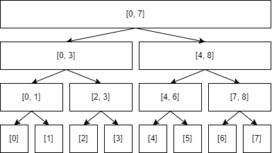

ここでは区間最小値(RMQ: **R**ange **M**inimum **Q**uery)を例にセグメント木を考える。

$a_{0},a_{1},...,a_{n-1}$ に対して、次の操作を効率的に行うことを目指す。

- $\underset{s\le i\le t}{\min}a_{i}$ を求める
- $a_{i}=x$ と更新する

各ノードは対応する区間の最小値を持つ。

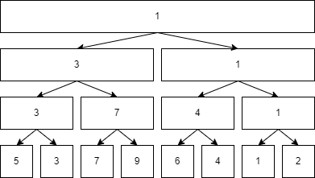

### セグメント木による RMQ のクエリ

$a_{0},a_{1},...,a_{6}$ の最小値を得るには、次の 3 つのノードを参照する。


ある区間の最小値は次のように再帰的に求める

- 与えられた区間とそのノードの区間が全く交差していなければ、最小値に影響しない値を返す
- 与えられた区間が完全にそのノードの区間を含むようなノードであれば、そのノードの持つ値を返す
- そうでなければ、2 つの子ノードについて再帰的に計算し、その 2 つの値の最小値を返す

<div className="flex flex-row m-3">
  <div className="w-1/3"></div>
  <span className="w-2/3 mx-4"></span>
</div>

<div className="flex flex-row my-3">
  <div className="w-1/3">
    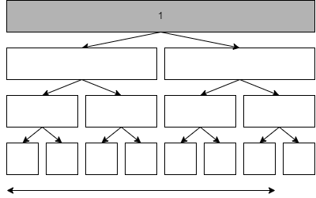
  </div>
  <span className="w-2/3 mx-4">
    <li>
      再帰は根ノードからスタートする。与えられた区間が一部ノードの区間を含んでいるため、2
      つの子ノードについて考える。
    </li>
  </span>
</div>

<div className="flex flex-row my-3">
  <div className="w-1/3">
    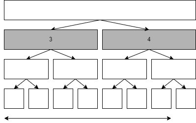
  </div>
  <span className="w-2/3 mx-4">
    <li>
      左ノードについて、与えられた区間がノードの区間を完全に含んでいるので値 3
      を返す。
    </li>
    <li>
      右ノードについて、与えられた区間が一部ノードの区間を含んでいるため、2
      つの子ノードについて考える。
    </li>
  </span>
</div>

<div className="flex flex-row my-3">
  <div className="w-1/3">
    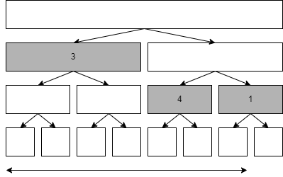
  </div>
  <span className="w-2/3 mx-4">
    <li>
      左ノードについて、与えられた区間がノードの区間を完全に含んでいるので値 4
      を返す。
    </li>
    <li>
      右ノードについて、与えられた区間が一部ノードの区間を含んでいるため、2
      つの子ノードについて考える。
    </li>
  </span>
</div>

<div className="flex flex-row my-3">
  <div className="w-1/3">
    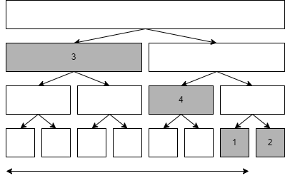
  </div>
  <span className="w-2/3 mx-4">
    <li>
      左ノードについて、与えられた区間がノードの区間を完全に含んでいるので値 1
      を返す。
    </li>
    <li>
      右ノードについて、与えられた区間とノードの区間が全く交差していないので、最小値に影響しない値を返す。
    </li>
  </span>
</div>

<div className="flex flex-row my-3">
  <div className="w-1/3">
    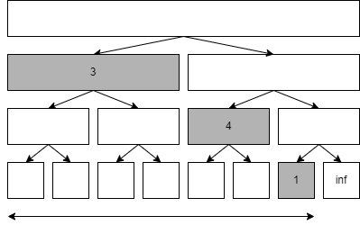
  </div>
  <span className="w-2/3 mx-4">
    <li>
      $\min(\min(\min(1, \inf), 4), 3)$ を再帰的に計算し、最小値 1 を得る。
    </li>
  </span>
</div>

### セグメント木による RMQ の値の更新

$a_{0}$ の値を更新する際は、次の 4 つのノードを再計算する。

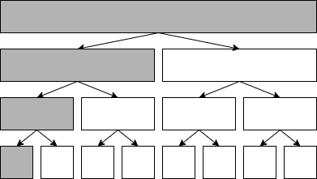

場所 $i$ の値を更新する際には、 $i$ を含む区間に対応する全てのノードについて値を計算しなおす必要がある。更新したいノードから親を辿ってき、各親の子の最小値へと更新すればよい。（各親ノードを更新する値と比較するのは間違いであることに注意する）

### セグメント木による RMQ の計算量

いずれの処理も高々深さの数程度のノードしか訪れない。よって $\mathcal{O}(\log{n})$

木の初期化及び空間計算量は $\mathcal{O}(n)$ なので注意。

### セグメント木による RMQ の実装

- 簡単のため要素数を 2 のべき乗に調整
- 木は配列で管理、長さは (要素数) $\times$ $2 - 1$
- 各ノードと配列上のインデックスの対応

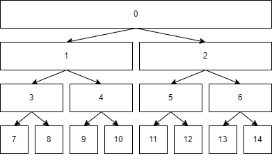

```python showLineNumbers
# Segment Tree (RMQ)

from typing import Callable


class SegmentTree:
    """Provides single point addition and obtaining the total product of a segment in O(logN)"""

    def __init__(self, n: int, op: Callable[[int, int], int], e: int) -> None:
        self.n = 1
        while self.n < n:
            self.n *= 2
        self.a: list[int] = [e] * (2 * self.n - 1)
        self.op: Callable[[int, int], int] = op
        self.e: int = e

    def update(self, i: int, x: int) -> None:
        """a[i] = x"""
        i += self.n - 1
        self.a[i] = x
        while i > 0:
            i = (i - 1) // 2
            self.a[i] = self.op(self.a[i * 2 + 1], self.a[i * 2 + 2])

    def query(
        self, l: int, r: int, temp_i: int = 0, check_l: int = 0, check_r: int = None
    ) -> int:
        """op(a[l], a[l + 1], ..., a[r])"""
        if check_r is None:
            check_r = self.n

        if check_r <= l or r <= check_l:
            return self.e
        if l <= check_l and check_r <= r:
            return self.a[temp_i]
        else:
            return self.op(
                self.query(l, r, temp_i * 2 + 1, check_l, (check_l + check_r) // 2),
                self.query(l, r, temp_i * 2 + 2, (check_l + check_r) // 2 + check_r),
            )

```

```python copy=false
>>> seg = SegmentTree(n=8, e=float("inf"), op=min)  # [inf, inf, inf, inf, inf, inf, inf, inf]
>>> seg.update(0, 3)  # [3, inf, inf, inf, inf, inf, inf, inf]
>>> seg.update(3, 2)  # [3, inf, inf, 2, inf, inf, inf, inf]
>>> seg.update(5, 0)  # [3, inf, inf, 2, inf, 0, inf, inf]
>>> seg.query(0, 4)  # min([3, inf, inf, 2, inf])
2
```

### セグメント木を用いる問題

```python showLineNumbers
# Crane

...
```

## Binary Indexed Tree（Fenwick 木）

**BIT**とは列 $a_{1},a_{2},...,a_{n}$ があり、はじめは全ての $a_{i}=0$ として、

- $add(i, x): a_{i} = a_{i} + x$
- $sum(i): a_{1}+a_{2}+...+a_{i}$

を実現するデータ構造である。

### Segment Tree による実装

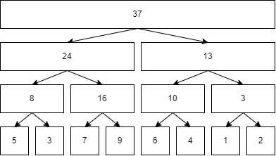

$sum(7)$ -> $24+10+1=37$  
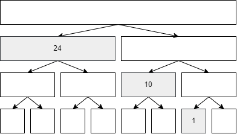

$add(1, 2)$  
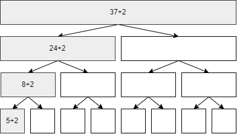

$a_{s},a_{s+1},...,a_{t}$ を求める場合は $sum(t) - sum(s - 1)$ を計算すればよく、区間和の計算にそういった制限を設けると、各クエリで右の子ノードは参照されなくなる。

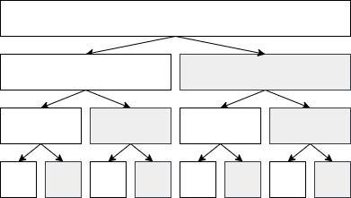

この考え方を元にしたデータ構造が BIT である。

### BIT の仕組み

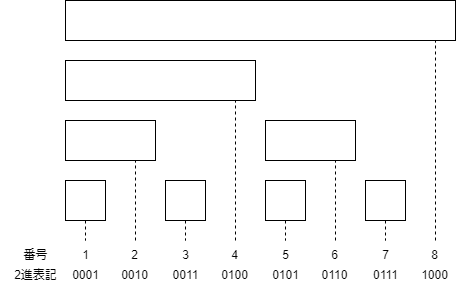

**POINT**

- 2 進表記されたノード番号の末尾の 0 の個数 = 区間の長さ - 1

### sum(i)

$i$ から $0$ に辿り着くまで、 $i$ より最後の $1$ のビットを減算しながら、 $i$ の場所の値を加算していく。

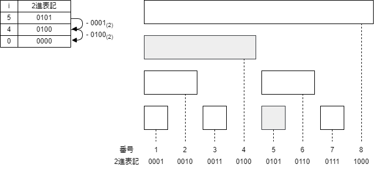

### add(i, x)

$i$ から始めて、 $i$ に最後の 1 のビットを加算しながら、 $i$ の場所の値に $x$ を加えていく。

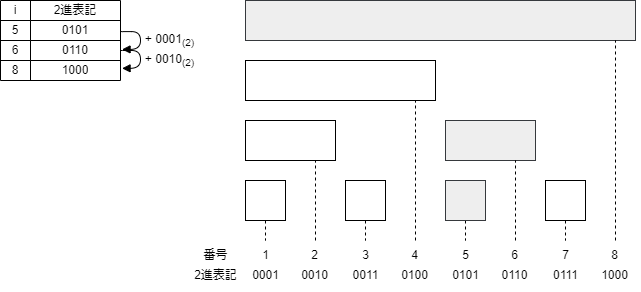

```python showLineNumbers
# BIT


class BIT:
    """Provides single point addition and interval summation in O(logN)."""

    def __init__(self, n: int):
        '''
        Create Array of n elements, a_0, a_1, ..., a_{n-1}.
        All elements are initialized to 0.
        '''
        self._n = n
        self._a = [0] * n

    def sum(self, l: int, r: int) -> int:
        """Return a[l] + a[l+1] + ... + a[r - 1]."""
        assert 0 <= l <= r <= self._n
        return self._sum(r) - self._sum(l)

    def _sum(self, r: int) -> int:
        """Return a[0] + a[1] + ... + a[i]."""
        s = 0
        while r > 0:
            s += self._a[r - 1]
            r -= r & -r
        return s

    def add(self, p: int, x: int):
        """Do a[p] += x."""
        assert 0 <= p < self._n
        p += 1
        while p <= self._n:
            self._a[p - 1] += x
            p += p & -p

```

```python copy=false
>>> bit = BIT(8)   # [0, 0, 0, 0, 0, 0, 0, 0]
>>> bit.add(0, 3)  # [3, 0, 0, 0, 0, 0, 0, 0]
>>> bit.add(2, 4)  # [3, 0, 4, 0, 0, 0, 0, 0]
>>> bit.add(4, 5)  # [3, 0, 4, 0, 5, 0, 0, 0]
>>> bit.sum(0, 4)  # 3 + 0 + 4 + 0
7
```

```python showLineNumbers
# バブルソートの交換回数

...
```

```python showLineNumbers
# A Simple Problem with Integers

...
```

## バケット法と平方分割

バケット法(bucket method)とは、列や平面をバケットなる単位に分割して、バケットごとにデータを管理することにより効率的な計算や操作を行う手法である。

特に、平方分割(sqrt decomposition)と呼ばれる、 $n$ 個の要素からなる列を $\sqrt{n}$ 程度ごとのバケットにまとめて管理する手法を用いると、区間に対する処理が $\mathcal{O}(\sqrt{n})$ 程度で行えるようになる。

### 平方分割による RMQ

数列 $a_{1},a_{2},...,a_{n}$ があるとき、次の 2 つの処理を $\mathcal{O}(\sqrt{n})$ で実現することを目指す。

- $\underset{s\le i\le t}{\min}a_{i}$ を求める
- $a_{i}=x$ を行う (1 点更新)

### 平方分割による RMQ の前処理

$b=\lfloor\sqrt{n}\rfloor$ とし、 $a$ を $b$ ごとのバケットに分け、各バケットでの最小値を計算する。

### 平方分割による RMQ のクエリ

- 区間に完全に含まれるバケットについては、そのバケットの最小値
- 自身のバケットが区間に含まれない要素については、個々の最小値

これらの最小値が区間の最小値となる。

### 平方分割による RMQ の値の更新

バケットの要素をチェックする必要がある？？

6, 100, 101, 102 -> 6
6 を 2000 に変える時。

### 平方分割による RMQ の計算量

### 平方分割を用いる問題

- 区間に存在する $x$ 以下の数の個数を効率的に数えたい -> 区間の大きさを $j-i$ 、 $x$ 以下の個数を $y$ とすると、 $j-i-y=k$ となる $x$ を二分探索すればよい

  - 区間に完全に含まれるバケットについては、(さらに)二分探索によって個数を計算する（各区間は事前にソートされている）
  - 自身のバケットが区間に完全に含まれない要素については、個々を調べる

  この計算量は、各バケットの大きさ（要素数） $b=\sqrt{n}$ 程度とすると、 $\mathcal{O}(\frac{n}{b}\log{b}+b)=\mathcal{O}(\sqrt{n}\log{n})$ となる。(バケット数 × 各バケットに対する計算量+1× 個々の要素数)

  - バケットに対する操作が、個々の要素に対する操作よりも重いので、もう少しバケットを大きくする（バケット個数を小さくする）方が効率的となる

  $b=\sqrt{n\log{n}}$ 程度とすると、 $\mathcal{O}(\frac{n}{b}\log{b}+b)=\mathcal{O}(\sqrt{n\log{n}})$

- 探索する $x$ の値は数列に含まれる値であるため、探索は $\mathcal{O}(\log{n})$ で行える。よって 1 クエリに対する計算量は $\mathcal{O}(\log{n}\times\sqrt{n\log{n}})=\mathcal{O}(\sqrt{n}\log^{\frac{3}{2}}n)$

- 前処理を含めると、全体としての計算量は $\mathcal{O}(n\log{n}+m\sqrt{n}\log^{\frac{3}{2}}n)$

```python showLineNumbers
# K-th Number

N: int
M: int
A: list[int]
I: list[int]
J: list[int]
K: list[int]

B: int = 1000

...
```

各ノードに**列**を持たせるセグメント木による解法も存在する。

- 構築においては、マージソートの過程がそのまま木となる
- ある区間の $x$ 以下の数の個数を求めるには
  - 与えられた区間とそのノードの区間が全く交差していなければ 0 個
  - 与えられた区間が完全にそのノードの区間を含むようなノードであれば、素のノードの持つ列で二分探索を行う
  - そうでなければ、2 つの子ノードについて再帰的に計算する

全体としての計算量は $\mathcal{O}(n\log{n}+m\log^{3}{n})$ となる

```python showLineNumbers
# K-th Number (Segment Tree)

...
```
