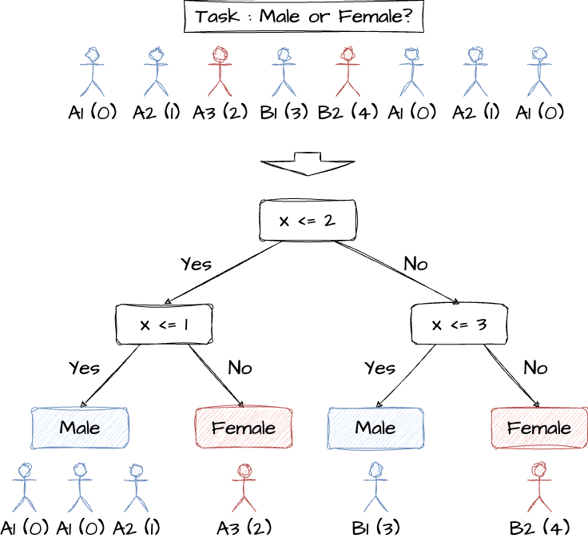

# 3.5 カテゴリ変数の変換

※本エントリは、2024 年 7 月に開催された、**Kaggle で勝つデータ分析の技術**[^1] の輪講の補足資料として作成されました。書誌からの引用は主従関係が明確になるよう細心の注意を払っておりますが、
万一引用の方法が不適切である場合や、引用の必要性を逸脱していると思われる場合には、お手数ですが [Contact Page](/) までご連絡をお願い申し上げます。

[^1]: 門脇大輔, 阪田隆司, 保坂桂佑, 平松雄司. Kaggle で勝つデータ分析の技術. 東京, 技術評論社, 2019, ISBN9784297108434.

> 「カテゴリ変数のカテゴリのことを水準と言います」 (位置 No. 2748)

## 3.5.1 one-hot encoding

各カテゴリ変数に対して、その水準の数だけ新しい列を生成する。`pd.get_dummies()` 関数は、水準名に対応した新しい列名を持つデータフレームを生成する。

```py
>>> import pandas as pd
>>> df = pd.DataFrame({"x1": [1, 2, 3], "x2": ['a', 'b', 'a']})
>>> df
   x1 x2
0   1  a
1   2  b
2   3  a
>>> pd.get_dummies(df)
   x1   x2_a   x2_b
0   1   True  False
1   2  False   True
2   3   True  False
>>> pd.get_dummies(df, columns=['x1', 'x2'])
    x1_1   x1_2   x1_3   x2_a   x2_b
0   True  False  False   True  False
1  False   True  False  False   True
2  False  False   True   True  False
```

水準数が多いとデータが疎 (一部が 1 の箇所を除き、ほとんどが 0 であるような状態) になってしまいメモリに負荷がかかるが、`sklearn.preprocessing.OneHotEncoder()` にて疎行列表現で省メモリにデータを保持することができる。(`pd.get_dummies()` のように元の水準の情報は保持されないことに注意)

```py
>>> from sklearn.preprocessing import OneHotEncoder
>>> encoder = OneHotEncoder()
>>> df_processed = encoder.fit_transform(df)
>>> print(df_processed)
  (0, 0)        1.0
  (0, 3)        1.0
  (1, 1)        1.0
  (1, 4)        1.0
  (2, 2)        1.0
  (2, 3)        1.0
```

## 3.5.2 label encoding

文字列の水準を数値に置き換えるだけなので変換することに本質的な意味はないが、例えば決定木モデルでは、分岐を繰り返すことで予測に利用できる場合がある。(文字列のままだと直接比較ができないというモデル側の都合のため？)



```py
>>> x = ['A1', 'A2', 'A3', 'B1', 'B2', 'A1', 'A2', 'A1']
>>> compressed = {e: i for i, e in enumerate(sorted(set(x)))}
>>> compressed
{'A1': 0, 'A2': 1, 'A3': 2, 'B1': 3, 'B2': 4}
>>> x_processed = [compressed[e] for e in x]
>>> x_processed
[0, 1, 2, 3, 4, 0, 1, 0]
```

## 3.5.3 feature hashing

one-hot encoding (3.5.1) の問題を解消するために、変換後の特徴量の数に制限を与える手法。異なる水準を持つデータであっても、変換後は同じ特徴量を持つ場合があり得
る。

```py
>>> N_FEATURES = 4
>>> x = ['a', 'b', 'c', 'd', 'e', 'f']
>>> x_processed = [hash(e) % N_FEATURES for e in x]
>>> x_processed
[2, 0, 1, 3, 0, 2]
```

> 「水準数が多くても label encoding で変換したあとに GBDT で学習することである程度対応できるためか、あまり使われることはありません」 (p.141)

## 3.5.4 frequency encoding

各水準の出現回数もしくは出現頻度でカテゴリ変数を置き換える手法。

```py
>>> import collections
>>> x = ['A1', 'A2', 'A3', 'B1', 'B2', 'A1', 'A2', 'A1']
>>> counter = collections.Counter(x)
>>> [counter[e] for e in x]
[3, 2, 1, 1, 1, 3, 2, 3]
>>> [counter[e] / len(x) for e in x]
[0.375, 0.25, 0.125, 0.125, 0.125, 0.375, 0.25, 0.375]
```

> 「各水準の出現頻度と目的関数の間に関連性がある場合には効果がある」 (p.142)

## 3.5.5 target encoding

目的変数を用いてカテゴリ変数を数値に変換する手法。

```py
>>> import collections
>>> x = ['A1', 'A2', 'A3', 'B1', 'B2', 'A1', 'A2', 'A1']
>>> y = [1, 0, 0, 1, 0, 1, 1, 0]
>>> counter = collections.Counter(x)
>>> subtotals = collections.defaultdict()
>>> for k, v in zip(x, y):
...     subtotals[k] += v
...
>>> x_processed = [subtotals[e] / counter[e] for e in x]
>>> x_processed
[0.66, 0.5, 0, 1, 0, 0.66, 0.5, 0.66]
```

上のように単純に全訓練データから平均を取ると、特に水準数が少ないようなデータに対しては容易に過学習し得るので注意する。

## 3.5.6 embedding

離散表現を意味や性質が表現された実数ベクトルに変換する手法。

事前学習済みモデルを利用する場合や、NN などでは embedding layer という単語やカテゴリ変数を学習する層があるとのこと。

## 3.5.7 順序変数の扱い

## 3.5.8 カテゴリ変数の値の意味を抽出する
