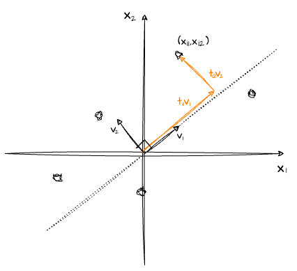
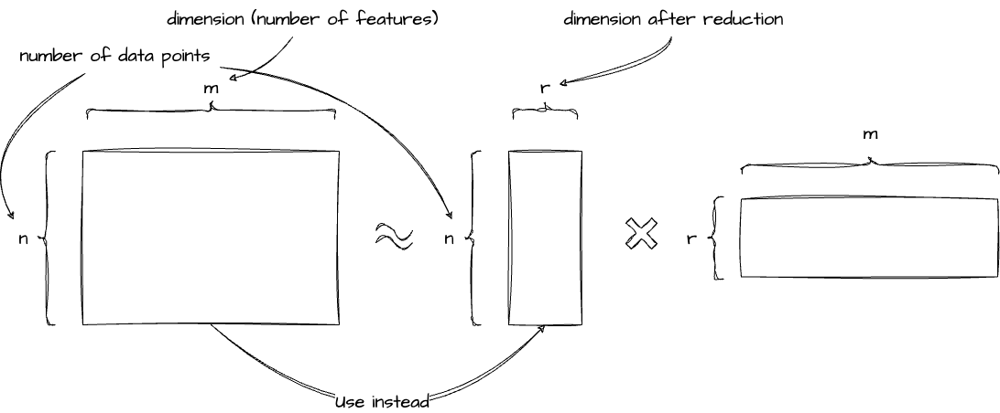

# 3.11 次元削減・教師なし学習による特徴量

| 手法名                             | 目的             | 備考                                                                                                                                                                           |
| ---------------------------------- | ---------------- | ------------------------------------------------------------------------------------------------------------------------------------------------------------------------------ |
| 主成分分析 (PCA)                   | 次元削減         | 変数間の従属性が高ければ、より少数の主成分で元データを表現できる                                                                                                               |
| 非負値行列因子分解 (NMF)           | 次元削減         | 非負データにしか使えないが、非負ベクトルの和の形で表現できる                                                                                                                   |
| Latent Dirichlet Allocation（LDA） | 次元削減         | 自然言語処理において、単語文書のカウント行列に対して、各文書のトピック分類を行う手法                                                                                           |
| 線形判別分析 (LDA)                 | 次元削減         | 分類タスクにおいて教師ありでで時限削減を行う手法                                                                                                                               |
| t-SNE                              | 次元削減／可視化 | 元の特徴量空間上にて、近い点が圧縮後の平面でも近くなるように圧縮できる。**非線形な関係を捉えることもできるため、元の特徴量にこれらの圧縮結果を加えて精度が上がることがある。** |
| UMAP                               | 次元削減         | t-SNE に比べ数分の 1 程度高速、高次元への圧縮も可能                                                                                                                            |
| オートエンコーダ                   | 次元削減         | ニューラルネットを用いる                                                                                                                                                       |
| K-Means                            | クラスタリング   |                                                                                                                                                                                |
| DBSCAN                             | クラスタリング   |                                                                                                                                                                                |
| Agglomerative Clustering           | クラスタリング   |                                                                                                                                                                                |

## なぜ次元削減が必要か？

- 学習コストの低下
- 可視化性能の向上

## 3.11.1 主成分分析 (PCA)

[Questions]

- 共分散行列の固有値問題を解くことがなぜ分散の最大化につながるのか？

[Keywords]

- 固有値問題
- ラグランジュの未定乗数法

---

多次元データのもつ情報をできるだけ損なわずに低次元空間に情報を縮約する手法。

$m$ 個の特徴量のデータが $n$ 点存在するとし、行列 $\boldsymbol{X}$ と各データ点に対応するベクトル $\boldsymbol{x}_i=(x_{i1}, x_{i2}, \ldots{}, x_{im}) \space{} (i=1,2,\ldots{n})$ を用いて与えられるとする。

$$
\boldsymbol{X} =
\begin{pmatrix}
  x_{11} & x_{12} & \dots{} & x_{1m} \\
  x_{21} & x_{22} & \dots{} & x_{2m} \\
  \vdots{} & \vdots{} & \ddots{} & \vdots{} \\
  x_{n1} & x_{n2} & \dots{} & x_{nm} \\
\end{pmatrix} =
\begin{pmatrix}
  \boldsymbol{x}_1 \\
  \boldsymbol{x}_2 \\
  \vdots{} \\
  \boldsymbol{x}_n \\
\end{pmatrix}
$$

$m$ 個の正規直交基底 $\boldsymbol{v}_1,\boldsymbol{v}_2,\ldots{},\boldsymbol{v}_m \in \R^m$ を用いて元データを近似することを考えたい。

- 正規直交基底 - 正規直交系である基底
  - 正規直交系 - $\R^n$ のベクトル $\boldsymbol{v}_1,\ldots{},\boldsymbol{v}_m$ が各々が長さ１で互いに直交する、つまり $\boldsymbol{v}_i\cdot{}\boldsymbol{v}_j=\delta_{ij}$ が成り立つとき、正規直交系と呼ぶ
  - 基底 - 座標系を作り出す 1 次独立なベクトルの集まり

具体的には、

$$
\boldsymbol{X} =
\begin{pmatrix}
  \boldsymbol{x}_1 \\
  \boldsymbol{x}_2 \\
  \vdots{} \\
  \boldsymbol{x}_n \\
\end{pmatrix} =
\begin{pmatrix}
  t_{11}\boldsymbol{v}_1 + t_{12}\boldsymbol{v}_2 + \cdots{} + t_{1m}\boldsymbol{v}_m \\
  t_{21}\boldsymbol{v}_1 + t_{22}\boldsymbol{v}_2 + \cdots{} + t_{2m}\boldsymbol{v}_m \\
  \vdots{} \\
  t_{n1}\boldsymbol{v}_1 + t_{n2}\boldsymbol{v}_2 + \cdots{} + t_{nm}\boldsymbol{v}_m \\
\end{pmatrix} \approx{}
\begin{pmatrix}
  t_{11}\boldsymbol{v}_1 + t_{12}\boldsymbol{v}_2 + \cdots{} + t_{1k}\boldsymbol{v}_k \\
  t_{21}\boldsymbol{v}_1 + t_{22}\boldsymbol{v}_2 + \cdots{} + t_{2k}\boldsymbol{v}_k \\
  \vdots{} \\
  t_{n1}\boldsymbol{v}_1 + t_{n2}\boldsymbol{v}_2 + \cdots{} + t_{nk}\boldsymbol{v}_k \\
\end{pmatrix}
$$

のように、$m$ 個の正規直交基底のうち、$k \space{} (\lt{} m)$ 個の正規直交基底を利用して各データ点を近似する。このとき、$\boldsymbol{v}_j$ を第 $j$ **主成分軸**、$t_{ij}$ をデータ点 $\boldsymbol{x}_i$ の第 $j$ 主成分軸における**主成分得点**と呼ぶ。($t_{ij}$ は主成分軸の基底 $v_j$ が決まれば求められることに注意)

### 主成分軸の算出

結論から述べると、特徴量の共分散行列 $\boldsymbol{S}$ に対する固有値問題を解くことで主成分軸は求められる。

ここで、共分散行列 $\boldsymbol{S}$ は、

$$
\begin{aligned}

\boldsymbol{S} &=
\frac{1}{n}
\begin{pmatrix}
\sum_{i=1}^{n} x_{i1}^2 & \sum_{i=1}^{n} x_{i1}x_{i2} & \cdots{} & \sum_{i=1}^{n} x_{i1}x_{im}\\
\sum_{i=1}^{n} x_{i2}x_{i1} & \sum_{i=1}^{n} x_{i2}^2 & \cdots{} & \sum_{i=1}^{n} x_{i2}x_{im}\\
\vdots{} & \vdots{} & \ddots{} & \vdots{} \\
\sum_{i=1}^{n} x_{im}x_{i1} & \sum_{i=1}^{n} x_{im}x_{i2} & \cdots{} & \sum_{i=1}^{n} x_{im}^2\\
\end{pmatrix} \\

&=
\frac{1}{n}
\begin{pmatrix}
  x_{11} & x_{21} & \dots{} & x_{m1} \\
  x_{12} & x_{22} & \dots{} & x_{m2} \\
  \vdots{} & \vdots{} & \ddots{} & \vdots{} \\
  x_{1n} & x_{2n} & \dots{} & x_{mn} \\
\end{pmatrix}
\begin{pmatrix}
  x_{11} & x_{12} & \dots{} & x_{1m} \\
  x_{21} & x_{22} & \dots{} & x_{2m} \\
  \vdots{} & \vdots{} & \ddots{} & \vdots{} \\
  x_{n1} & x_{n2} & \dots{} & x_{nm} \\
\end{pmatrix} \\

&=
\frac{1}{n} \boldsymbol{X}^T\boldsymbol{X}
\end{aligned}
$$

とかける。

- 共分散行列 (分散共分散行列) - $\boldsymbol{S}$ の $(i,j) \space(i\neq{}j)$ 成分は特徴量 $i$ と特徴量 $j$ の共分散を、$(i,i)$ 成分は特徴量 $i$ の分散を意味する

各データ点を第 $j$ 主成分軸に射影した点 $t_{1j}, \ldots{}, t_{nj}$ の分散を最大化することを考えたい。

$\boldsymbol{x}_i$ と $\boldsymbol{v}_j$ の内積がデータ点 $\boldsymbol{x}_i$ の主成分軸 $\boldsymbol{v}_j$ への射影になる、つまり $\boldsymbol{x}_i\cdot{}\boldsymbol{v}_j = t_{ij}$ であることを踏まえれば、射影した点 $t_{1j}, \ldots{}, t_{nj}$ の分散は次式のように計算できる。

$$
\begin{aligned}
\frac{1}{n}{\sum_{i=1}^{n}{t_{ij}^2}} &= \frac{1}{n}{\sum_{i=1}^{n}{(\boldsymbol{x}_i\cdot{}\boldsymbol{v}_j)^2}} \\
                                      &= \frac{1}{n}
                                      \begin{pmatrix}
                                        \boldsymbol{x}_1 \cdot{} \boldsymbol{v}_j & \boldsymbol{x}_2 \cdot{} \boldsymbol{v}_j & \cdots{} &  \boldsymbol{x}_n \cdot{} \boldsymbol{v}_j
                                      \end{pmatrix}
                                      \begin{pmatrix}
                                        \boldsymbol{x}_1 \cdot{} \boldsymbol{v}_j & \boldsymbol{x}_2 \cdot{} \boldsymbol{v}_j & \cdots{} &  \boldsymbol{x}_n \cdot{} \boldsymbol{v}_j
                                      \end{pmatrix}^T \\
                                      &=\frac{1}{n}
                                      \left(
                                      \begin{pmatrix}
                                        \boldsymbol{x}_1 \\
                                        \boldsymbol{x}_2 \\
                                        \vdots{} \\
                                        \boldsymbol{x}_n \\
                                      \end{pmatrix} \boldsymbol{v}_j
                                      \right)^T
                                      \left(
                                      \begin{pmatrix}
                                        \boldsymbol{x}_1 \\
                                        \boldsymbol{x}_2 \\
                                        \vdots{} \\
                                        \boldsymbol{x}_n \\
                                      \end{pmatrix} \boldsymbol{v}_j
                                      \right)
                                      \\
                                      &= \frac{1}{n} \left(\boldsymbol{X}\boldsymbol{v}_j\right)^T \left(\boldsymbol{X}\boldsymbol{v}_j\right) \\
                                      &= \frac{1}{n} \boldsymbol{v}_j^T\boldsymbol{X}^T\boldsymbol{X}\boldsymbol{v}_j \\
                                      &= \boldsymbol{v}_j^T\boldsymbol{S}\boldsymbol{v}_j
\end{aligned}
$$

よって、ある主成分軸 $j$ への射影後の各データ点の分散を最大化するには、$\boldsymbol{v}_j^T\boldsymbol{S}\boldsymbol{v}_j$ を最大化すればよいことが分かる。

特に、正規直交基底として $|\boldsymbol{v}_j|^2 = 1$ を仮定していたので、この問題は制約付き最大化問題としてラグランジュの未定乗数法を用いて解くことができる。

- ラグランジュの未定乗数法 - 多変数関数において条件付きの局地問題を解く方法
  - [定理] 束縛条件 $g(\boldsymbol{x})=0$ の下で、$f(\boldsymbol{x})$ を最大となる $\boldsymbol{x}$ を求める問題において、束縛条件に対して用意される定数 (未定乗数) を含めた新たな関数 $\mathcal{L}(\boldsymbol{x}, \lambda{}) = f(\boldsymbol{x}) + \lambda{}g(\boldsymbol{x})$ に対して、$f(\boldsymbol{x})$ が束縛条件 $g(\boldsymbol{x})=0$ の下で最大化されるとき、$\partial{\mathcal{L}}/\partial{\boldsymbol{x}}=\boldsymbol{0}, \partial{\mathcal{L}}/\partial{\lambda{}}=0$ が成立する。

要するに、

$$
\begin{aligned}
\text{max.} &\quad{} \boldsymbol{v}_j^T\boldsymbol{S}\boldsymbol{v}_j \\
\text{s.t.} &\quad{} \boldsymbol{v}_j^T\boldsymbol{v}_j = 1
\end{aligned}
$$

の解である $j$ 主成分軸のベクトル $\boldsymbol{v}_j$ は、ラグランジュの未定乗数法によれば、$\lambda{} \in{} \R$ を導入によって定義される $\mathcal{L}(\boldsymbol{v}_j, \lambda{}) = \boldsymbol{v}_j^T\boldsymbol{S}\boldsymbol{v}_j - \lambda{}(\boldsymbol{v}_j^T\boldsymbol{v}_j - 1)$ の極値問題を解くことで得られるということである。

$\mathcal{L}(\boldsymbol{v}_j, \lambda{})$ を $\boldsymbol{v}_j$ で微分すると、

$$
\begin{aligned}
  \partial{\mathcal{L}}/\partial{\boldsymbol{v}_j} &= 2\boldsymbol{S}\boldsymbol{v}_j - 2\lambda{}\boldsymbol{v}_j \\
                                                   &=2(\boldsymbol{S}\boldsymbol{v}_j - \lambda{}\boldsymbol{v}_j)
\end{aligned}
$$

であり、$\partial{\mathcal{L}}/\partial{\boldsymbol{v}_j} = 0$ として解けば $\boldsymbol{S}\boldsymbol{v}_j = \lambda{}\boldsymbol{v}_j$ が得られるが、これは共分散行列 $\boldsymbol{S}$ に対する固有値問題に他ならない。

同様にして、$\partial{\mathcal{L}}/\partial{\lambda{}} = 0$ 解いて得られる $\boldsymbol{v}_j^T\boldsymbol{v}_j = 1$ は、正規直交基底の条件そのものである。

## 3.11.2 非負値行列因子分解 (NMF) [^nmf]

[^nmf]: Lee, Daniel & Seung, Hyunjune. (2001). Algorithms for Non-negative Matrix Factorization. Adv. Neural Inform. Process. Syst.. 13.

[Keywords]

- イェンセンの不等式
- 補助関数法

---

非負行列を２つの非負行列の積で表現する手法。

なぜ非負にこだわるのかというと、[東京大学の資料](http://hil.t.u-tokyo.ac.jp/~kameoka/SAP/SAP13_06.pdf) によれば、

- 実世界には非負値データが多いこと
- 係数行列をスパースに誘導することができ、その結果基底行列の情報量が増える

とのこと。

$$
\boldsymbol{Y} \approx{} \boldsymbol{H}\boldsymbol{U}
$$

ただし、$\boldsymbol{Y}\in\R_{+}^{N,K}, \boldsymbol{H}\in\R_{+}^{K,M}, \boldsymbol{U}\in\R_{+}^{M,N}$であり、$\boldsymbol{H}$ を基底行列、$\boldsymbol{U}$ を係数行列という。

$$
\begin{aligned}
  \text{min}  & \quad{} D(\boldsymbol{H},\boldsymbol{U}) = \sum_{i=1}^{N}\sum_{j=1}^{K}\left(y_{i,j} - \sum_{k=1}^{M}h_{i,k}u_{k,j}\right)^2\\
  \text{s.t.} & \quad{} h_{i,k} \ge 0 \qquad{} i=1,\ldots{},N,k=1,\ldots{},M \\
              & \quad{} u_{k,j} \ge 0 \qquad{} k=1,\ldots{},M,j=1,\ldots{},K \\
\end{aligned}
$$

目的関数を展開すると、

$$
\begin{aligned}
  D(\boldsymbol{H},\boldsymbol{U}) = & \sum_{i=1}^{N}\sum_{j=1}^{K}\left(y_{i,j} - \sum_{k=1}^{M}h_{i,k}u_{k,j}\right)^2 \\
  =& \sum_{i=1}^{N}\sum_{j=1}^{K} \left( y_{i,j}^2 - 2y_{i,j}\sum_{k=1}^{M}h_{i,k}u_{k,j} + \left(\sum_{k=1}^{M}h_{i,k}u_{k,j}\right)^2 \right)
\end{aligned}
$$

---

（補足）$D(\boldsymbol{H},\boldsymbol{U})$ の展開をさらに進めると、

$$
\begin{aligned}
  & \sum_{i=1}^{N}\sum_{j=1}^{K} \left( y_{i,j}^2 - 2y_{i,j}\sum_{k=1}^{M}h_{i,k}u_{k,j} + \left(\sum_{k=1}^{M}h_{i,k}u_{k,j}\right)^2 \right) \\
  =& \sum_{i=1}^{N}\sum_{j=1}^{K} \left( y_{i,j}^2 - 2y_{i,j}\sum_{k=1}^{M}h_{i,k}u_{k,j} + \sum_{k=1}^{M}h_{i,k}^2u_{k,j}^2 + 2\sum_{k\neq{}l}h_{i,k}u_{k,j}h_{i,l}u_{l,j} \right) \\
\end{aligned}
$$

のように、$h_{i,k}v_{k,j}$ に関する項が増え、解析的に解を求めることが困難になる。

---

ここで、$\sum_{k=1}^{M}\lambda{}_{i,j,k}=1$ の下で $\lambda{}_{i,j,k} > 0$ を導入すると、イェンセンの不等式から、

$$
\begin{aligned}
  & \sum_{i=1}^{N}\sum_{j=1}^{K} \left( y_{i,j}^2 - 2y_{i,j}\sum_{k=1}^{M}h_{i,k}u_{k,j} + \left(\sum_{k=1}^{M}h_{i,k}u_{k,j}\right)^2 \right) \\

  =& \sum_{i=1}^{N}\sum_{j=1}^{K} \left( y_{i,j}^2 - 2y_{i,j}\sum_{k=1}^{M}h_{i,k}u_{k,j} + \left(\sum_{k=1}^{M} \lambda{}_{i,j,k} \frac{h_{i,k}u_{k,j}}{\lambda{}_{i,j,k}}\right)^2 \right) \\

  \le& \sum_{i=1}^{N}\sum_{j=1}^{K} \left( y_{i,j}^2 - 2y_{i,j}\sum_{k=1}^{M}h_{i,k}u_{k,j} + \sum_{k=1}^{M}\lambda{}_{i,j,k}\left(\frac{h_{i,k}u_{k,j}}{\lambda{}_{i,j,k}}\right)^2 \right) \\

  =& \sum_{i=1}^{N}\sum_{j=1}^{K} \left( y_{i,j}^2 - 2y_{i,j}\sum_{k=1}^{M}h_{i,k}u_{k,j} + \sum_{k=1}^{M}\frac{h_{i,k}^2u_{k,j}^2}{\lambda{}_{i,j,k}} \right)\\
\end{aligned}
$$

と目的関数の上限となる関数が得られ、これを $\boldsymbol{\lambda{}} = \{\lambda{}_{i,j,k}\}_{N\times{}K\times{}M}$ を用いて $G(\boldsymbol{H}, \boldsymbol{U}, \boldsymbol{\lambda{}})$ とおく。等号は、$\frac{h_{i,1}u_{1,j}}{\lambda{}_{i,j,1}} = \frac{h_{i,2}u_{2,j}}{\lambda{}_{i,j,2}} = \cdots{} = \frac{h_{i,M}u_{M,j}}{\lambda{}_{i,j,M}}$ のとき成り立つ。

これにより、補助関数法に従えば、

$$
\begin{aligned}
  \boldsymbol{\lambda{}} &\leftarrow{} \underset{\boldsymbol{\boldsymbol{\lambda{}}}}{\argmin{}}G(\boldsymbol{H}, \boldsymbol{U}, \boldsymbol{\lambda{}}) \\
  \boldsymbol{H} &\leftarrow{} \underset{\boldsymbol{H}}{\argmin{}}G(\boldsymbol{H}, \boldsymbol{U}, \boldsymbol{\lambda{}}) \\
  \boldsymbol{U} &\leftarrow{} \underset{\boldsymbol{U}}{\argmin{}}G(\boldsymbol{H}, \boldsymbol{U}, \boldsymbol{\lambda{}})
\end{aligned}
$$

を繰り返し行うことで、目的関数 $D(\boldsymbol{H},\boldsymbol{U})$ の値を最小化できるということである。

まず、イェンセンの不等式の等号成立条件 $\frac{h_{i,1}u_{1,j}}{\lambda{}_{i,j,1}} = \frac{h_{i,2}u_{2,j}}{\lambda{}_{i,j,2}} = \cdots{} = \frac{h_{i,M}u_{M,j}}{\lambda{}_{i,j,M}}$ から、

$$
\begin{aligned}
  \lambda{}_{i,j,1} &= \frac{h_{i,1}u_{1,j}}{h_{i,1}u_{1,j}}\lambda{}_{i,j,1} \\
  \lambda{}_{i,j,2} &= \frac{h_{i,2}u_{2,j}}{h_{i,1}u_{1,j}}\lambda{}_{i,j,1} \\
  \vdots{} \\
  \lambda{}_{i,j,M} &= \frac{h_{i,M}u_{M,j}}{h_{i,1}u_{1,j}}\lambda{}_{i,j,1} \\
\end{aligned}
$$

が得られ、$\sum_{k=1}^{M}\lambda{}_{i,j,k}=1$ に代入すると、

$$
\frac{h_{i,1}u_{1,j}}{h_{i,1}u_{1,j}}\lambda{}_{i,j,1}+ \frac{h_{i,2}u_{2,j}}{h_{i,1}u_{1,j}}\lambda{}_{i,j,1} + \cdots{}+ \frac{h_{i,M}u_{M,j}}{h_{i,1}u_{1,j}}\lambda{}_{i,j,1} = 1
$$

から、

$$
\lambda{}_{i,j,1} = \frac{h_{i,1}u_{1,j}}{\sum_{k=1}^{M}{h_{i,k}v_{k,j}}}
$$

が得られる。$\lambda{}_{i,j,2},\ldots{},\lambda{}_{i,j,M}$ らについても同様に計算すると、

$$
\lambda{}_{i,j,k} = \frac{h_{i,k}u_{k,j}}{\sum_{k'=1}^{M}{h_{i,k'}v_{k',j}}}
$$

として関数 $G(\boldsymbol{H}, \boldsymbol{U}, \boldsymbol{\lambda{}})$ の最小の値を与える $\boldsymbol{\lambda{}}$ が計算できた。

次に、$G(\boldsymbol{H}, \boldsymbol{U}, \boldsymbol{\lambda{}})$ は、次式のように行列 $\boldsymbol{H}$ の各要素 $h_{i,k}$ ごとに分離できる。各 $h_{i,k}$ について整理すると、

$$
G(\boldsymbol{H},\boldsymbol{U},\boldsymbol{\lambda{}}) = \sum_{i=1}^{N}\sum_{j=1}^{K}y_{i,j}^2 + \sum_{i=1}^{N}\sum_{k=1}^{M}\left( \left( \sum_{j=1}^{K}-2y_{i,j}v_{k,j} \right) h_{i,k} + \left( \sum_{j=1}^{K} \frac{u_{k,j}^2}{\lambda{}_{i,j,k}} \right) h_{i,k}^2 \right)
$$

のように、$h_{i,k}$ ごとに独立な二次関数の和の形で表現できるので、それぞれの $h_{i,k}$ を個別に最小化することで式全体を最小化できる。式の値を最小化する各 $\hat{h}_{i,k}$ は、

$$
\hat{h}_{i,k} = \frac{\sum_{j=1}^{K} y_{i,j}v_{k,j}}{\sum_{j=1}^{K} \frac{u_{k,j}^2}{\lambda{}_{i,j,k}}}
$$

であり、同様にして行列 $\boldsymbol{U}$ の各要素 $u_{k,j}$ に対しても $G(\boldsymbol{H},\boldsymbol{U},\boldsymbol{\lambda{}})$ を最小化する $\hat{u}_{k,j}$ も、

$$
\hat{u}_{k,j} = \frac{\sum_{i=1}^{N} y_{i,j}h_{i,k}}{\sum_{i=1}^{N} \frac{h_{i,k}^2}{\lambda{}_{i,j,k}}}
$$

のように求まる。

各行列要素の値の更新を繰り返すことで、目的関数 $D(\boldsymbol{H},\boldsymbol{U})$ の値を単調減少させることができる。

### イェンセンの不等式 (Jensen's inequality)

任意の凸関数 $g$、$I$ 個の実数 $x_1,\ldots{},x_I$、$\sum_{i=1}^{I}{\lambda{}_i}=1$ を満たす $I$ 個の正値の重み係数 $\lambda{}_1,\ldots{},\lambda{}_I$ のもとで、

$$
g\left(\sum_{i=1}^{I}{\lambda{}_i x_{i}}\right) \le \sum_{i=1}^{I}{\lambda_{i}g(x_i)}
$$

が成り立つ。等号は $x_1=x_2=\cdots{}=x_I$ のとき成立する。

(証明) $I=2$ のとき、不等式は凸関数の性質そのものである。$I=k$ のとき、不等式が成り立つと仮定して、$I=k+1$ のとき、

$$
g\left(\sum_{i=1}^{k+1}{\lambda{}_i x_{i}}\right) \le \sum_{i=1}^{k+1}{\lambda_{i}g(x_i)}
$$

となることを示したい。

問題の仮定より、$\sum_{i=1}^{k+1}{\lambda{}_i}=1$ である。ここで、$\sum_{i=1}^{k}{\frac{\lambda{}_i}{1-\lambda_{k+1}}}=1$ であることと、帰納法の仮定から、

$$
g\left(\sum_{i=1}^{k}{\frac{\lambda{}_i}{1-\lambda_{k+1}} x_{i}}\right) \le \sum_{i=1}^{k}{\frac{\lambda_{i}}{1-\lambda_{k+1}}g(x_i)} \tag{1}
$$

が得られる。

さらに、$(1-\lambda_{k+1})+\lambda_{k+1}=1$ と凸関数の性質から、

$$
\begin{aligned}
g\left((1-\lambda_{k+1}) \left(\sum_{i=1}^{k}{\frac{\lambda{}_i}{1-\lambda_{k+1}}}x_i \right) + \lambda_{k+1}x_{k+1}  \right) &\le (1-\lambda_{k+1})g\left(\sum_{i=1}^{k}{\frac{\lambda{}_i}{1-\lambda_{k+1}}}x_i\right) + \lambda_{k+1}g(x_{k+1}) \\
\end{aligned}
$$

であり、右辺は $(1)$ より、

$$
\begin{aligned}
  (1-\lambda_{k+1})g\left(\sum_{i=1}^{k}{\frac{\lambda{}_i}{1-\lambda_{k+1}}}x_i\right) + \lambda_{k+1}g(x_{k+1}) &\le (1-\lambda{}_{k+1})\sum_{i=1}^{k}{\frac{\lambda_{i}}{1-\lambda_{k+1}}g(x_i)} + \lambda{}_{k+1}g(x_{k+1}) \\
    &= \sum_{i=1}^{k+1}{\lambda{}_ig(x_i)}
\end{aligned}
$$

によって題意の不等式が示された。

### 補助関数法

目的関数が非線形であるといった理由等で解の探索が困難な場合、目的関数の上限となる補助関数を反復的に降下させることで目的関数を間接的に降下させることができる。

$\theta{}=\{\theta{}_i\}_{1\le{i}\le{I}}$ を変量とする目的関数 $D(\theta{})$ に対し、

$$
D(\theta{}) = \underset{{\bar{\theta{}}}}{\min{}}G(\theta{}, \bar{\theta{}})
$$

が成り立つとき、$G(\theta{}, \bar{\theta{}})$ を $D(\theta{})$ を補助関数、$\bar{\theta{}}$ を補助変数という。

補助関数 $G(\theta{},\bar{\theta{}})$ を、$\bar{\theta{}}$ に関して最小化するステップと、$\theta_{1},\ldots{},\theta_{I}$ に関して最小化するステップ

$$
\begin{aligned}
  \bar{\theta} &\leftarrow{} \underset{\bar{\theta{}}}{\argmin{}}{G(\theta{}, \bar{\theta{}})} \\
  \theta{}_i &\leftarrow{} \underset{\theta{}_i}{\argmin{}}{G(\theta{},\bar{\theta{}})}
\end{aligned}
$$

を繰り返すと、目的関数 $D(\theta{})$ の値は単調減少する。

## 3.11.3 Latent Dirichlet Allocation (LDA)

## 3.11.4 線形判別分析 (LDA, Linear Discriminant Analysis)

分類タスクについて教師ありで次元削減を行う手法。

## 3.11.5 t-SNE、UMAP

元の空間での点同士の近さが、圧縮後の空間での点同士の近さと出来るだけ同じになるように圧縮する手法。

### SNE

データ点 $x_i,x_j$ の類似度を、「$x_j$ は $x_i$ **を中心とした正規分布に基づいて確率的に選択されると仮定した上で**、$x_i$ が与えられた時に、近傍として $x_j$ として選択する条件付き確率」と定義する。

$$
\begin{aligned}
P(j|i) = \frac{\exp{-||x_i-x_j||^2/2\sigma_i^2}}{\sum_{k\neq{}i}{\exp{-||x_i-x_k||^2/2\sigma_i^2}}}

\end{aligned}
$$

(参考) 正規分布の確率密度関数

$$
f(x|\mu, \sigma) = \frac{1}{\sigma\sqrt{2\pi}}\exp{-\frac{1}{2}\left(\frac{x-\mu}{\sigma}\right)^2}
$$

### t-distributed Stochastic Neighbor Embedding (t 分布型確率的近傍埋め込み)

<https://jmlr.org/papers/volume9/vandermaaten08a/vandermaaten08a.pdf>

## 3.11.6 オートエンコーダ

入力と同じものを出力するようにトレーニングされたニューラルネットワークを用いる手法。

## 3.11.7 クラスタリング

$$
$$
