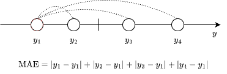
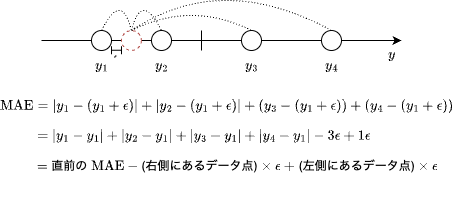
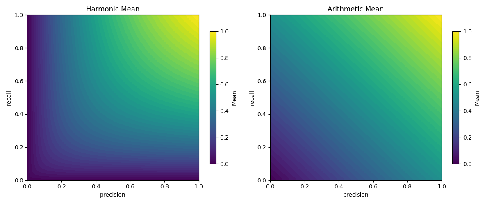
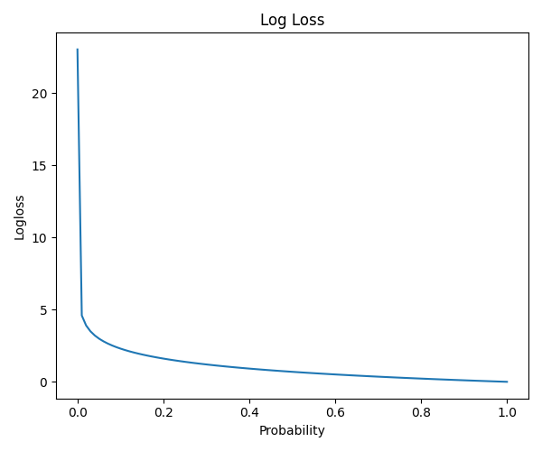
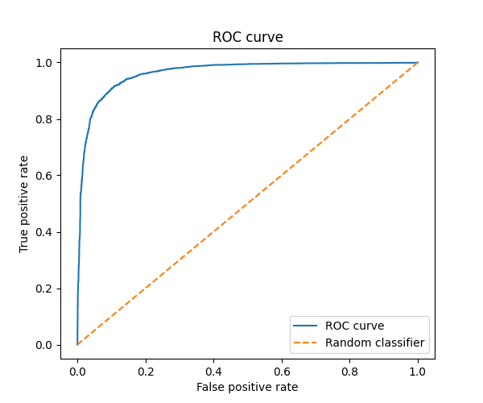

# 2.3 評価指標

※本エントリは、2024 年 6 月に開催された、**Kaggle で勝つデータ分析の技術**[^1] の輪講の補足資料として作成されました。書誌からの引用は主従関係が明確になるよう細心の注意を払っておりますが、
万一引用の方法が不適切である場合や、引用の必要性を逸脱していると思われる場合には、お手数ですが [Contact Page](/) までご連絡をお願い申し上げます。

[^1]: 門脇大輔, 阪田隆司, 保坂桂佑, 平松雄司. Kaggle で勝つデータ分析の技術. 東京, 技術評論社, 2019, ISBN9784297108434.

---

## 2.3.2 回帰における評価指標

| 評価指標                                    | 式                                                                            | Pros                   | Cons                     |
| ------------------------------------------- | ----------------------------------------------------------------------------- | ---------------------- | ------------------------ |
| RMSE (Root Mean Squared Error)              | $\sqrt{\frac{1}{N}\sum_{i=1}^{N}{(y_i-\hat{y_i})^2}}$                         | 式がシンプル           | 外れ値の影響を受けやすい |
| RMSLE (Root Mean Squared Logarithmic Error) | $\sqrt{\frac{1}{N}\sum_{i=1}^{N}{(\log{(1+y_i)}-\log{(1+\hat{y_i})})^2}}$     |                        |                          |
| MAE                                         | $\frac{1}{N}\sum_{i=1}^{N}{\|y_i-\hat{y_i}\|}$                                | 誤差による影響が少ない | 2 次微分が 0             |
| 決定係数                                    | $1-\frac{\sum_{i=1}^{N}{(y_i-\hat{y_i})^2}}{\sum_{i=1}^{N}{(y_i-\bar{y})^2}}$ |                        |                          |

### RMSE (Root Mean Squared Error : 平均平方二乗誤差)

$$
\text{RMSE} = \sqrt{\frac{1}{N}\sum_{i=1}^{N}{(y_i-\hat{y_i})^2}}
$$

> 「RMSE を最小化した場合に求まる解が、誤差が正規分布に従うという前提のもとで求まる最尤解と同じになる」（位置 No. 1405）

- 最小二乗法では RMSE を最小化するが、果たして誤差の 2 乗を取ることが最もベストな方法か？ 4 乗ではだめか？絶対値をとるのは？ [条件付き対数尤度と平均二乗誤差](https://ai999.careers/rabbit/wp/wp-content/uploads/2021/03/第二稿_条件付き対数尤度と平均二乗誤差.pdf)
- 正規分布 ( $\mu$: mean, $\sigma$: standard deviation )
  $$
  f(x|\mu,\sigma)=\frac{1}{\sigma\sqrt{2\pi}}\exp{\left(-\frac{1}{2}\left(\frac{x-\mu}{\sigma}\right)^2\right)}
  $$
  - 正規分布に属するデータ $x_1,x_2,\ldots,x_n$ が与えられた時、分布のパラメータが $\mu,\sigma$ である正規分布からそれらのデータが得られる確率 $f(x_1,x_2,\ldots,x_n|\mu,\sigma)$ は $f(x_1,x_2,\ldots,x_n|\mu,\sigma)=\prod_{i=1}^{n}\frac{1}{\sigma\sqrt{2\pi}}\exp{-\frac{1}{2}\left(\frac{x_i-\mu}{\sigma}\right)^2}$ である
- 誤差 $y_i-\hat{y_i}$ が $N(0,\sigma)$ に従うとしたとき、データ $y_1,y_2,\ldots,y_n$ が観測される確率を最大化するパラメータ $\sigma$ を求めたい
- 尤度関数
  $$
  \begin{align*}
  L(\sigma) &= \prod_{i=1}^{n}\frac{1}{\sigma\sqrt{2\pi}}\exp{\left(-\frac{1}{2}\left(\frac{y_i-\hat{y_i}}{\sigma}\right)^2\right)} \\
  \end{align*}
  $$
  を最大化するには？
- 両辺対数を取ると、

  $$
  \begin{align*}
    \log{L(\sigma)} &= \log{\left(\prod_{i=1}^{n}\frac{1}{\sigma\sqrt{2\pi}}\exp{\left(-\frac{1}{2}\left(\frac{y_i-\hat{y_i}}{\sigma}\right)^2\right)}\right)} \\
                    &= \sum_{i=1}^{n}\log{\left(\frac{1}{\sigma\sqrt{2\pi}}\exp{\left(-\frac{1}{2}\left(\frac{y_i-\hat{y_i}}{\sigma}\right)^2\right)}\right)} \\
                    &= n\log{\frac{1}{\sigma\sqrt{2\pi}}} + \sum_{i=1}^{n}{-\frac{1}{2}{\left(\frac{y_i-\hat{y_i}}{\sigma}\right)^2}} \\
                    &= n\log{\frac{1}{\sigma\sqrt{2\pi}}} - \frac{1}{2\sigma^2} \sum_{i=1}^{n}{{(y_i-\hat{y_i})^2}} \\
  \end{align*}
  $$

  となり、対数尤度関数を最大化するには、$\sum_{i=1}^{n}{{(y_i-\hat{y_i})^2}}$ を最小化することと同義であることが分かる

- Question: 他の誤差ならどう？対数誤差とか

### RMSLE (Root Mean Squared Logarithmic Error)

$$
\text{RMSLE} = \sqrt{\frac{1}{N}\sum_{i=1}^{N}{(\log{(1+y_i)}-\log{(1+\hat{y_i})})^2}}
$$

> 「目的変数の対数をとって変換した値を新たな目的変数とした上で RMSE を最小化すれば、RMSLE を最小化することになる」（位置 No. 1422）

### MAE (Mean Absolute Error)

$$
\text{MAE} = \frac{1}{N}\sum_{i=1}^{N}{|y_i-\hat{y_i}|}
$$

> 「MAE は外れ値の影響を低減した形での評価に適した関数」（位置 No. 1435）

- RMSE のように 2 乗をとることはないため、誤差が増幅されることがない

> 「$\hat{y_i}$ による微分が $\hat{y_i}=y_i$ と不連続であったり、二次微分が常に 0」（位置 No. 1436）

- $y_i \gt \hat{y_i}$ のとき、

> 「仮に一つの代表値で予測を行う場合、MAE を最小化する予測値は中央値」（位置 No. 1439）

- 一見平均値かと思うが、例えば $\{1, 2, 100\}$ のようなデータでは、平均値となる $\frac{1+1+100}{3}=34$ による予測誤差 $|1-34|+|1-34|+|100-34|=132$ より中央値 $1$ による予測誤差 $|1-1|+|1-1|+|100-1|=99$ の方が小さくなる
- データ点が偶数個の場合、データを昇順に並び替えたときの中央にあたる 2 つのデータ点の間の値を用いても MAE は最小化される
  - (例えば $\{1,2,3,5\}$ の場合、中央値 $2.5$ でなくとも、$[2,3]$ に含まれる値であれば MAE を最小化するということ)
- (略証)
  - 予測値を $y'=\min_i{y_i}$ としたとき、予測誤差は $\sum_{i}{y'-y_i}$ となる。ここから微小な正の定数 $\epsilon{}$ を用いて、予測値を $y'=y'+\epsilon{}$ と更新すると、予測誤差は $y' < y_i$ を満たす $y_i$ の個数と $\epsilon{}$ の積だけ減少し、$y' > y_i$ を満たす $y_i$ の個数と $\epsilon{}$ の積だけ増加する。
  - 
  - 
  - この操作を繰り返すと、中央値で $y'<y_i$ を満たす $y_i$ の個数と $y'>y_i$ を満たす $y_i$ の個数が一致するため、予測誤差の減少がストップし、ここが予測誤差を最小にする予測値であることが分かる

### 決定係数 ($R^2$)

$$
\begin{align*}
\text{R}^2 &= 1-\frac{\sum_{i=1}^{N}{(y_i-\hat{y_i})^2}}{\sum_{i=1}^{N}{(y_i-\bar{y})^2}} \\
   \bar{y} &= \frac{1}{N}{\sum_{i=1}^{N}{y_i}}
\end{align*}
$$

> 「この指標を最大化することは RMSE を最小化することと同じ意味」（位置 No. 1445）

- 第 2 項の分母 $\sum_{i=1}^{N}{(y_i-\bar{y})^2}$ は定数なので、分子 (RME の $N$ 倍) $\sum_{i=1}^{N}{(y_i-\hat{y_i})^2}$ を最小化することは決定係数を最大化することと等しい
- 誤差が 0 のとき、決定係数が 1 で最大となる。

第 2 項の分母の意味は？

- データの広がり具合による影響を無くしている？
- TODO: 考える

## 2.3.3 二値分類における評価指標〜正例が負例かを予測値とする場合

予測の仕方が次の表のような場合。

| ID  | 真の値 (正例: 1, 負例: 0) | 予測値 (正例: 1, 負例: 0) |
| --- | ------------------------- | ------------------------- |
| 0   | 1                         | 1                         |
| 1   | 0                         | 0                         |
| 2   | 1                         | 1                         |
| 3   | 1                         | 0                         |
| 4   | 0                         | 1                         |

| 評価指標   | 式                                                                                    | Pros                                       | Cons                 |
| ---------- | ------------------------------------------------------------------------------------- | ------------------------------------------ | -------------------- |
| accuracy   | $\frac{TP+TN}{TP+TN+FP+FN}$                                                           | 手軽                                       | 不均衡なデータに弱い |
| error rate | $1-\text{accuracy}$                                                                   |                                            |                      |
| precision  | $\frac{TP}{TP+FP}$                                                                    | 誤検知の割合が分かる                       |                      |
| recall     | $\frac{TP}{TP+FN}$                                                                    | 正例を見逃し率が分かる                     |                      |
| F1-score   | $\frac{2TP}{2TP+FP+FN}$                                                               | precision と recall のバランスをとっている |                      |
| MCC        | $\frac{TP \times{} TN - FP \times{} FN}{\sqrt{(TP + FP)(TP + FN)(TN + FP)(TN + FN)}}$ | 不均衡なデータにも強い                     |                      |

### 混同行列 (confusion matrix)

| 予測＼真の値 | 正例                        | 負例                        |
| ------------ | --------------------------- | --------------------------- |
| 正例         | 真陽性 (True Positive: TP)  | 偽陽性 (False Positive: FP) |
| 負例         | 偽陰性 (False Negative: FN) | 真陰性 (True Negative: TN)  |

- 陽性／陰性は予測した値 (正例／負例) に対応する
- 真／偽は予測の正誤に対応する

### accuracy (正答率) と error rate (誤答率)

> 「accuracy は予測が正しい割合、error rate は誤っている割合を示す指標」（位置 No. 1478）

> 「不均衡なデータの場合は特にモデルの性能を評価しづらい」（位置 No. 1481）

- 正例が 1% しか含まれないようなデータセットにおいて、すべて負例であると予測するようなモデルがあったとする
  - accuracy は 0.99 だが、例えば正例が重病患者であるようなデータセットであれば問題となり得る
    | 予測＼真の値 | 正例 | 負例 |
    | ------------ | ------ | ------- |
    | 正例 | 0 (TP) | 0 (FP) |
    | 負例 | 1 (FN) | 99 (TN) |

### precision (適合率) と recall (再現率)

$$
\begin{align*}
\text{precision} &= \frac{TP}{TP+FP} \\
\text{recall} &= \frac{TP}{TP+FN} \\
\end{align*}
$$

> 「precision は、正例と予測したもののうち真の値も正例の割合」  
> 「recall は真の値が正例のもののうちどの程度を正例の予測として含めることができているかの割合」（位置 No. 1500）

- 上の例だと recall は 0 なので、正例の見逃しを避けたい場合には recall を重視することになる
- 他方で、誤検知を避けたい場合は precision に重きが置かれる

> 「precision と recall は、互いにトレードオフの関係になっています」（位置 No. 1505）

- recall を上げたい、言い換えると見逃しを避けたいのであれば、(極端な話) 全て正例と予測するモデルを考えればよい
  - このとき、データセットに含まれる負例の割合が多いほど precision は悪化する
- 他方で precision を上げたい、つまり誤検知を避けたいのであれば、よほど自信があるもの以外は負例と予測するモデルを考えればよい
  - このとき、recall (正例を見逃さなかった割合) は悪化すると予想される

### F1-score と Fβ-score

$$
\begin{align*}
\text{F}_1 &= \frac{2}{\frac{1}{\text{recall}}+\frac{1}{\text{precision}}}=\frac{2\cdot{}\text{recall}\cdot{}\text{precision}}{\text{recall}+\text{precision}} = \frac{2TP}{2TP+FP+FN} \\
\text{F}_\beta &= \frac{1+\beta{}^2}{\frac{\beta{}^2}{\text{recall}}+\frac{1}{\text{precision}}}=\frac{(1+\beta{}^2)\cdot{}\text{recall}\cdot{}\text{precision}}{\text{recall}+\beta{}^2\text{precision}}
\end{align*}
$$

> 「precision と recall の調和平均」（位置 No. 1511）

- 算術平均 $(\text{recall}+\text{precision})/2$ とは異なり、調和平均は個々のバランスを重視する
  - 言い換えると、片方の指標の値のみが改善しても F1-score には影響しにくい
  - 下図において、真上や右の方向ではなく、右上の方向に移動 (precision と recall を同時に大きく) した方が値が改善しやすいということ
    

### MCC (Matthews Correlation Coefficient)

| 予測＼真の値 | 正例                        | 負例                        |
| ------------ | --------------------------- | --------------------------- |
| 正例         | 真陽性 (True Positive: TP)  | 偽陽性 (False Positive: FP) |
| 負例         | 偽陰性 (False Negative: FN) | 真陰性 (True Negative: TN)  |

$$
\text{MCC} = \frac{TP \times{} TN - FP \times{} FN}{\sqrt{(TP + FP)(TP + FN)(TN + FP)(TN + FN)}}
$$

## 2.3.4 二値分類における評価指標〜正例である確率を予測値とする場合

| ID  | 真の値 (正例: 1, 負例: 0) | 正例であると予測する確率 |
| --- | ------------------------- | ------------------------ |
| 0   | 1                         | 0.9                      |
| 1   | 0                         | 0.1                      |
| 2   | 1                         | 0.5                      |
| 3   | 1                         | 0.8                      |
| 4   | 0                         | 0.3                      |

| 評価指標                       | 式                                                                                                            | Pros | Cons |
| ------------------------------ | ------------------------------------------------------------------------------------------------------------- | ---- | ---- |
| logloss                        | $-\frac{1}{N}\sum_{i=1}^{N}{(y_i\log{p_i} + (1-y_i)\log{(1-p_i)})}$                                           |      |      |
| AUC (Area Under the ROC curve) | $\frac{\|\{(i,j)\space\|\space y_i=1,y_j=0,\hat{y_i}>\hat{y_j}\}\|}{\|\{(i,j)\space\|\space y_i=1,y_j=0\}\|}$ |      |      |
| Gini                           | $2\cdot{}\text{AUC}-1$                                                                                        |      |      |

### logloss

$$
\begin{align*}
  \text{logloss} &= -\frac{1}{N}\sum_{i=1}^{N}{(y_i\log{p_i} + (1-y_i)\log{(1-p_i)})} \\
                 &= -\frac{1}{N}\sum_{i=1}^{N}{p'_i} \\
\end{align*}
$$

- $p_i$ は正例である確率
- $p'_i$ は真の値の予測確率 $y_i=1$ (正例) の場合 $p_i$ を、$y_i=0$ (負例) の場合 $1-p_i$ を意味する

「logloss は低い方が良い指標」（位置 0. 1538）

- 予測確率の対数の符号を逆転したもの
- 予測を大きく外した際にペナルティが与えられる

  

### AUC (Area Under the ROC Curve)

| 予測＼真の値 | 正例                        | 負例                        |
| ------------ | --------------------------- | --------------------------- |
| 正例         | 真陽性 (True Positive: TP)  | 偽陽性 (False Positive: FP) |
| 負例         | 偽陰性 (False Negative: FN) | 真陰性 (True Negative: TN)  |

ROC 曲線の下側の面積。ROC 曲線は予測値を正例とする閾値を 1 から 0 に動かした時に、偽陽性率を x 軸に真陽性率を y 軸にプロットしたときに描画される。
ここで偽陽性率は $FP/(FP+TN)$、真陽性率 $TP/(TP+FN)$ として計算される。いずれもそれぞれの真の値の中での割合であることに注意。

正例と負例の割合が 1:1 のデータセットがあって、比較的良い予測ができたモデル (半分の正例データに対して 0.8、もう半分に対して 0.6 の予測確率をもち、半分の負例データに対して 0.4、もう半分に対して 0.2 の予測確率をもつような) ができたと考える。このとき、

- step0 では、予測確率が 1.0 以上であれば正例として予測されるとする
  - NPR は 0、TPR は 0
- step1 では、予測確率が 0.75 以上であれば正例として予測されるとする
  - NPR は 0、TPR は 0.5
- step2 では、予測確率が 0.50 以上であれば正例として予測されるとする
  - NPR は 0、TPR は 1.0
- step3 では、予測確率が 0.25 以上であれば正例として予測されるとする
  - NPR は 0.5、TPR は 1.0
- step4 では、予測確率が 0.0 以上であれば正例として予測されるとする
  - NPR は 1.0、TPR は 1.0

| 予測＼真の値 | 正例 (step0) | 負例 (step0) | →   | 正例 (step1) | 負例 (step1) | →   | 正例 (step2) | 負例 (step2) | →   | 正例 (step3) | 負例 (step3) | →   | 正例 (step4) | 負例 (step4) |
| ------------ | ------------ | ------------ | --- | ------------ | ------------ | --- | ------------ | ------------ | --- | ------------ | ------------ | --- | ------------ | ------------ |
| 正例         | 0            | 0            |     | 25           | 0            |     | 50           | 0            |     | 50           | 25           |     | 50           | 50           |
| 負例         | 50           | 50           |     | 25           | 50           |     | 0            | 50           |     | 0            | 25           |     | 0            | 0            |

他方で、完全にランダムな予測をするモデルを考えると、

- step0 では、予測確率が 1.0 以上であれば正例として予測されるとする
  - NPR は 0、TPR は 0
- step1 では、予測確率が 0.75 以上であれば正例として予測されるとする
  - NPR は 0.25、TPR は 0.25
- step2 では、予測確率が 0.50 以上であれば正例として予測されるとする
  - NPR は 0.5、TPR は 0.5
- step3 では、予測確率が 0.25 以上であれば正例として予測されるとする
  - NPR は 0.75、TPR は 0.75
- step4 では、予測確率が 0.0 以上であれば正例として予測されるとする
  - NPR は 1.0、TPR は 1.0

| 予測＼真の値 | 正例 (step0) | 負例 (step0) | →   | 正例 (step1) | 負例 (step1) | →   | 正例 (step2) | 負例 (step2) | →   | 正例 (step3) | 負例 (step3) | →   | 正例 (step4) | 負例 (step4) |
| ------------ | ------------ | ------------ | --- | ------------ | ------------ | --- | ------------ | ------------ | --- | ------------ | ------------ | --- | ------------ | ------------ |
| 正例         | 0            | 0            |     | 12           | 13           |     | 25           | 25           |     | 38           | 37           |     | 50           | 50           |
| 負例         | 50           | 50           |     | 38           | 37           |     | 25           | 25           |     | 12           | 13           |     | 0            | 0            |

以上の観察から、『正例データに対して、正例であると予測した確率の最小値』 > 『負例データに対して、正例であると予測した確率の最大値』が成り立てば左上で曲がるような直角の ROC 曲線となり、AUC は 1 になることが分かる。つまり、予測確率の大小関係のみが重要であり、**正例データであると予測するもののうち、より値が大きいものが正例**であるように予測できていれば AUC は高くなる。

## 2.3.5 多クラス分類における評価指標

### multi-class accuracy

### multi-class logloss

### mean-F1 と macro-F1 と micro-F1

マルチラベル分類の例

| ID  | 真の値 | 予測値 |
| --- | ------ | ------ |
| 0   | 1,2    | 1,3    |
| 1   | 1      | 2      |
| 2   | 1,2,3  | 1,3    |
| 3   | 2,3    | 3      |
| 4   | 3      | 3      |

| ID  | 真の値 (ラベル 1 が含まれるか) | 予測値 (ラベル 1 が含まれるか) | 真の値 (ラベル 2 が含まれるか) | 予測値 (ラベル 2 が含まれるか) | 真の値 (ラベル 3 が含まれるか) | 予測値 (ラベル 3 が含まれるか) |
| --- | ------------------------------ | ------------------------------ | ------------------------------ | ------------------------------ | ------------------------------ | ------------------------------ |
| 0   | 1                              | 1                              | 1                              | 0                              | 0                              | 1                              |
| 1   | 1                              | 0                              | 0                              | 1                              | 0                              | 0                              |
| 2   | 1                              | 1                              | 1                              | 0                              | 1                              | 1                              |
| 3   | 0                              | 0                              | 1                              | 0                              | 1                              | 1                              |
| 4   | 0                              | 0                              | 0                              | 0                              | 1                              | 1                              |

#### mean-F1

レコード単位で計算した F1-score の平均値 (表を横に見る)

#### macro-F1

それぞれのクラスで計算した F1-score の平均値 (表を縦に見る)

#### micro-F1

クラスとレコード混同で計算される F1-score

### quadratic weighted kappa

$$
\kappa{} = 1 - \frac{\sum_{i,j}{w_{i,j}O_{i,j}}}{\sum_{i,j}{w_{i,j}{E_{i,j}}}}
$$

- $O_{i,j}$ - 真の値のクラスが $i$、予測値のクラスが $j$ のレコード数
- $E_{i,j}$ - 真の値のクラスと予測値のクラスの分布が互いに独立であるとした場合に、混同行列の各セルに属するレコード数の期待値（全体レコード数を按分した値）
- $w_{i,j}$ - 真の値と予測値の差の二乗 $(i-j)^2$ 大きく離れたクラスを予測してしまうほどペナルティが科される（**クラス間の順序関係の存在を仮定している**）

## 2.3.6 レコメンデーションにおける評価指標

### MAP@K

$$
\text{MAP@K} = \frac{1}{N}\sum_{i=1}^{N}\left({\frac{1}{\min{(m_i,K)}}\sum_{k=1}^{K}{P_i(k)}}\right)
$$

- $m_i$ - レコード $i$ の属しているクラスの数
- $P_i(k)$ - レコード $i$ について、$k\space(1\le{k}\le{K})$ 番目までの予測値で計算される precision
