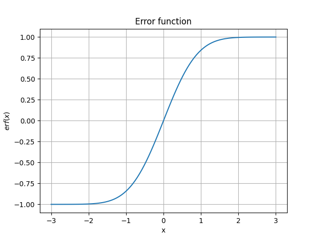
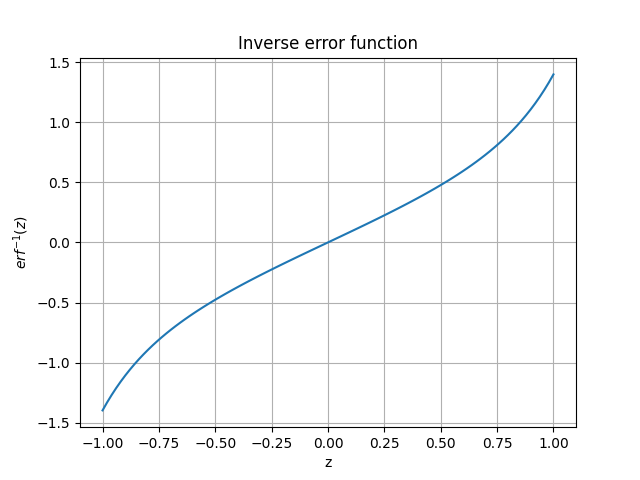
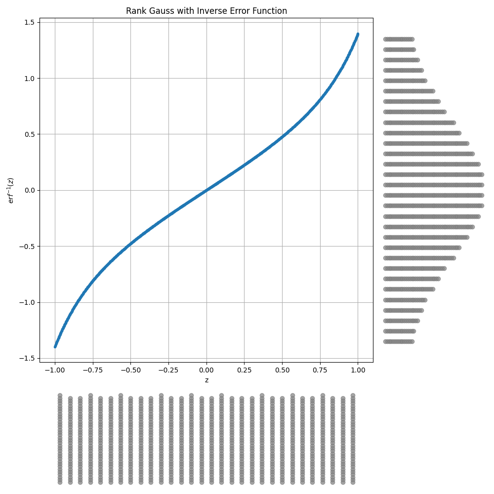

# 3.4 数値変数の変換

※本エントリは、2024 年 7 月に開催された、**Kaggle で勝つデータ分析の技術**[^1] の輪講の補足資料として作成されました。書誌からの引用は主従関係が明確になるよう細心の注意を払っておりますが、
万一引用の方法が不適切である場合や、引用の必要性を逸脱していると思われる場合には、お手数ですが [Contact Page](/) までご連絡をお願い申し上げます。

[^1]: 門脇大輔, 阪田隆司, 保坂桂佑, 平松雄司. Kaggle で勝つデータ分析の技術. 東京, 技術評論社, 2019, ISBN9784297108434.

## 3.4.1 標準化 (standardization)

Z スケーリングとも？

$$
\frac{x_i - \mu}{\sigma}
$$

## 3.4.2 Min-Max スケーリング

データの正規化（特定の範囲に収めること？）(normalization) 手法の一つ。

$$
\frac{x_i - x_{\min{}}}{x_{\max{}}-x_{\min{}}}
$$

## 3.4.3 非線形変換

## 3.4.5 binning

> 「数値変数を区間ごとにグループ分けして、あえてカテゴリ変数として扱う方法」(位置 No. 2435)

- データに対して事前知識がある場合に有効な手法 (金額を)
- 等間隔に分割する方法、分位点を用いて分割する方法、区間の区切りを指定して分割する方法などが考えられる
- ビニング処理後は、そのまま数値として扱うか、one-hot encoding することが可能、その後データをラベルの値ごとに集約できる
- (蛇足) 二分探索を利用した binning

  ```py
  >>> import bisect
  >>> breakpoints = [60, 70, 80, 90]
  >>> grades = 'DCBAS'
  >>> for score in 33, 60, 77, 70, 89, 90, 100:
  ...     i = bisect.bisect_right(breakpoints, score)
  ...     print(score, '→', grades[i])
  ...
  33 → D
  60 → C
  77 → B
  70 → B
  89 → A
  90 → S
  100 → S
  ```

## 3.4.6 順位への変換

> 「数値の大きさや間隔の情報をあえて捨て、大小関係のみを抽出する方法」 (位置 No. 2451)

| 店舗名 |     | Mon   | Tue | Wed | Thu | Fri | Sat | Sun | Total |
| ------ | --- | ----- | --- | --- | --- | --- | --- | --- | ----- |
| A      |     | 100   | 100 | 100 | 100 | 100 | 500 | 500 | 1,500 |
| B      |     | 150   | 150 | 150 | 150 | 150 | 150 | 150 | 1,050 |
| C      |     | 1,200 | 0   | 0   | 0   | 0   | 0   | 0   | 1,200 |

↓

| 店舗名 |     | Mon | Tue | Wed | Thu | Fri | Sat | Sun |
| ------ | --- | --- | --- | --- | --- | --- | --- | --- |
| A      |     | 3   | 2   | 2   | 2   | 2   | 1   | 1   |
| B      |     | 2   | 1   | 1   | 1   | 1   | 2   | 2   |
| C      |     | 1   | 3   | 3   | 3   | 3   | 3   | 3   |

- 座標圧縮でも似たようなことができる

  ```py
  >>> x = [10, 20, 30, 0, 40, 40]
  >>> compressed = {v: i for i, v in enumerate(sorted(set(x)))}
  >>> compressed
  >>> {0: 0, 10: 1, 20: 2, 30: 3, 40: 4}
  >>> rank = [compressed[e] for e in x]
  >>> rank
  >>> [1, 2, 3, 0, 4, 4]
  ```

## 3.4.7 RankGauss

> 「数値変数を順位に変換したあと、順序を保ったまま半ば無理矢理に正規分布となるように変換する」 (位置 No. 2466)

- 順位付した後、$[-1,1]$ の範囲にスケーリングし、逆誤差関数に通すとのこと

### 補足: 逆誤差関数

[wikipedia](https://ja.wikipedia.org/wiki/誤差関数) によれば、誤差関数 (error function) とは、次式で与えられる関数である。

$$
\text{erf}(x) = \frac{2}{\sqrt{\pi{}}}\int_0^{x}{e^{-t^2}} dt
$$



逆誤差関数は次のような級数となる。

$$
\text{erf}^{-1}(z) = \frac{1}{2}\sqrt{\pi{}}\left(z + \frac{\pi{}}{12}z^3 + \frac{7\pi{}^2}{480}z^5 + \frac{127\pi{}^3}{40320}z^7 + \frac{4369\pi{}^4}{5806080}z^9+\cdots{}\right)
$$



$[-1,1]$ の等間隔の 1000 点のデータを逆誤差関数に通して得られたデータのヒストグラムを描画した。確かにランク化された変数を $[-1,1]$ にスケーリングした上でこの逆関数に通すと、標準正規分布っぽいものを描くような気がしてくる。



> 「ニューラルネットでモデルを作成する際の変換として、通常の標準化よりも良い性能を示すとのことです」(位置 No. 2470)
